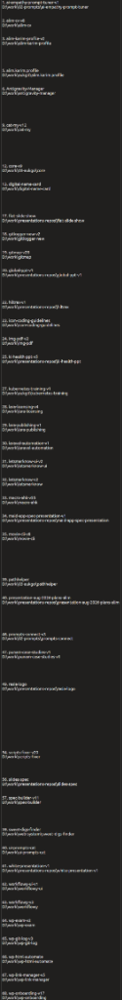

# Consolidated Completed Plan 14: White Blue Theme Design System, Parent Task N-Steps V3 Prompt & 43-Repository Synchronization

- **Spec Reference:** [02-spec/21-app/14-white-blue-theme-v3-prompt-and-multi-repo-sync.md](../../../02-spec/21-app/14-white-blue-theme-v3-prompt-and-multi-repo-sync.md)
- **Visual Reference:** 
- **Status:** COMPLETED (100% Verified)
- **Execution Architecture:** 2-Phase Continuous Loop (`A = 2` Subagents, `H = 2` Hands per Agent)
- **Completed At:** 2026-09-30

---

## 1. How the Main Task Started & Verbatim User Request

The task was initiated to reverse-engineer the reference UI into a reusable, blind-AI-accessible `04-white-blue-theme` design system specification inside `02-spec/07-design-system/` (with zero mention of the source brand name and every color documented in 3 standard formats: `HEX`, `RGB`/`RGBA`, and `HSL` + `OKLCH`), author the new `01-prompts/14-execute/10-execute-parent-task-with-n-steps-v3.md` prompt (featuring the V3 title/header flavor, `N = 300` at the top header, and mandatory `invoke_subagent` `A = 2, H = 2` spawning), synchronize all skills, and execute the 4-stage `pull -> backup & pre-release -> sync guidelines/prompts/skills -> post-release` ceremony across the 43 target repositories.

```text
reference-white-blue-ui

Okay. So I want you to read the reference White Blue UI from this work directory. And mostly what I want you to do is understand its theming, component, coloring, everything. So create a white theme inside your design spec folder. That means inside the spec folder, there is this design system folder, okay? Where you can create a theme called 04 white theme [source-brand], and then do not mention [source-brand], just try to mention white theme. Okay? White blue theme. And in this white blue theme, I want you to add everything for an AI to understand and follow through the aspects of the, let's say, components, coloring, color theme. So understand how these other themes are written, how the other design systems are mentioned. Okay? So based on that, I want you to create your own component base, color base, and every time the color needs to be in three formats. If there is animation, I want you to mention this animation. So take some code parts as well, some examples, so that any AI can understand it very well. Okay. I really like the cleanness of that software, how the website is displayed. Cleanness, color, fonts, everything, the component-wise. It's really amazing. I want you to follow everything so that an AI who is actually blind, it can follow through and understand and fix it. Also, at the same time, I want you to create a prompt. There is a prompt, right? So parent task with N steps V2. I want you to create V3. So V3 would be similar to the previous one. If you know, we have V3 folder, right? So that has a title and how the prompts were there. So we will have some of the flavor from this, and the N will be on top. N will be on the header where we can change it. Usually from now on, the N will be 300 steps, and the agent spawning would be must. Currently, the agents are not spawning, sub agents. That is a big mistake I think you have done. So I can fix that and just create a new prompt. Parent task with N steps V3. Okay. Keep it in the same folder. Try to go deep and then create that prompt, and then from there, try to create and sync the skills. Okay? I hope you understand. And also after that, I want you to sync with other code bases so that the coding guideline is sync, coding guideline and skills. Okay? And before you sync that, try to do a pull on those repositories that I'm mentioning. Okay? So in those repositories, we're going to take a backup first. Okay? Backup and release first, and then you are going to put the new prompts, new skills, and then make another release. Do you understand? Yes.
```

---

## 2. Consolidated Subtask Execution Ledger

### Subtask 01: White Blue Theme Master Index, 3-Format Color Palettes & Fluid Typography (`Task-01`, `Task-02`)
- **Delivered Files:**
  - [`02-spec/07-design-system/04-white-blue-theme/readme.md`](../../../02-spec/07-design-system/04-white-blue-theme/readme.md)
  - [`02-spec/07-design-system/04-white-blue-theme/01-colors-typography-and-tokens.md`](../../../02-spec/07-design-system/04-white-blue-theme/01-colors-typography-and-tokens.md)
- **Outcome:** Documented the complete Light-First High-Trust Enterprise Editorial architecture ("White Blue Theme" / "White Theme"), 4-tier Mermaid token flow diagram, alternating section band rhythm (`light` -> `soft` -> `dark` -> `void`), 3-font Google Fonts loading contract (`Ubuntu` + `Poppins` + `JetBrains Mono`; ban on `Inter`), 10 fluid `@utility` typography classes (`text-mega`, `text-h1`..`text-h4`, `text-lead`, `text-eyebrow`, `text-stat`, `text-numeral`, `text-wordmark`), and 3-format color tables (`HEX`, `RGB`/`RGBA`, `HSL` + `OKLCH`) across all ramps with zero mention of the external project name.

### Subtask 02: White Blue Theme Navigation, Buttons, Motion, Cards & Section Library (`Task-02`)
- **Delivered Files:**
  - [`02-spec/07-design-system/04-white-blue-theme/02-header-mega-menu-and-footer.md`](../../../02-spec/07-design-system/04-white-blue-theme/02-header-mega-menu-and-footer.md)
  - [`02-spec/07-design-system/04-white-blue-theme/03-buttons-motion-and-interactions.md`](../../../02-spec/07-design-system/04-white-blue-theme/03-buttons-motion-and-interactions.md)
  - [`02-spec/07-design-system/04-white-blue-theme/04-cards-heroes-and-section-library.md`](../../../02-spec/07-design-system/04-white-blue-theme/04-cards-heroes-and-section-library.md)
  - [`02-spec/07-design-system/readme.md`](../../../02-spec/07-design-system/readme.md)
  - [`02-spec/07-design-system/99-consistency-report.md`](../../../02-spec/07-design-system/99-consistency-report.md)
  - [`02-spec/17-consolidated-guidelines/10-design-system.md`](../../../02-spec/17-consolidated-guidelines/10-design-system.md)
- **Outcome:** Authored complete React/TSX, CSS `@utility`, and LESS code blueprints for the sticky `72px` header, safe-region Mega-Menu with 3D Flip Promo Card, `SlideSwapLabel`, `WhiteBlueButton` (`.shine-sweep` & `.pointer-fill`), `Magnetic`, `Reveal` / `StaggerGroup` / `MaskedHeading`, `TiltCard`, `SpotlightCard`, `ToggleRow`, `SurfaceCard`, `GlassCard`, `NeuCard`, `.card-premium`, `.row-premium`, Self-Assembling `CapabilityStack` Hero, `SolutionsGrid`, Pinned Sticky-Note Workflow Board (`PushPin` + `NoteConnector`), and Fluted Glass `ScrollStack`.

### Subtask 03: Parent Task with N Steps V3 Prompt (`N = 300` Header & Mandatory Subagent Spawning) & Skills (`Task-03`, `Task-04`)
- **Delivered Files:**
  - [`01-prompts/14-execute/10-execute-parent-task-with-n-steps-v3.md`](../../../01-prompts/14-execute/10-execute-parent-task-with-n-steps-v3.md)
  - [`06-old-prompts/v3/14-execute/10-execute-parent-task-with-n-steps-v3.md`](../../../06-old-prompts/v3/14-execute/10-execute-parent-task-with-n-steps-v3.md)
  - [`.agents/skills/execute-parent-task-with-n-steps-v3/skill.md`](../../../.agents/skills/execute-parent-task-with-n-steps-v3/skill.md)
  - [`.agents/skills/execute-parent-task-with-n-steps/skill.md`](../../../.agents/skills/execute-parent-task-with-n-steps/skill.md)
  - [`.agents/skills/parent-task-n-step-loop/skill.md`](../../../.agents/skills/parent-task-n-step-loop/skill.md)
  - [`.cursor/skills/execute-parent-task-with-n-steps-v3/skill.md`](../../../.cursor/skills/execute-parent-task-with-n-steps-v3/skill.md)
  - [`.cursor/skills/execute-parent-task-with-n-steps/skill.md`](../../../.cursor/skills/execute-parent-task-with-n-steps/skill.md)
  - [`01-prompts/readme.md`](../../../01-prompts/readme.md)
  - [`.ai-memory/prompts.md`](../../prompts.md)
- **Outcome:** Created the V3 prompt combining the V3 H1 title and `> [!IMPORTANT]` header flavor with `N = 300` placed at the very top of the header and a non-bypassable `MANDATORY SUBAGENT SPAWNING GATE (A = 2, H = 2 — ZERO SOLO EXECUTION ALLOWED)` enforcing `invoke_subagent` in both Phase 1 and Phase 2. Synchronized all corresponding Antigravity and Cursor skills and indexed all 160 prompts in `.ai-memory/prompts.md`.

### Subtask 04: Multi-Repository Pull, Pre-Sync Backup & Release, Guideline/Prompt/Skill Sync & Post-Sync Release (`Task-05`, `Task-06`)
- **Delivered Files:**
  - [`03-ai-scripts/38-sync-prompts-skills-scripts.py`](../../../03-ai-scripts/38-sync-prompts-skills-scripts.py)
  - [`03-ai-scripts/42-sync-v3-prompts-and-skills.py`](../../../03-ai-scripts/42-sync-v3-prompts-and-skills.py)
- **Outcome:** Upgraded `38-sync-prompts-skills-scripts.py` to synchronize `01-prompts/`, `.agents/skills/`, `.cursor/skills/`, `03-ai-scripts/`, `.agents/scripts/`, and coding guidelines/design system specs (`02-spec/02-coding-guidelines/`, `02-spec/07-design-system/`, `02-spec/17-consolidated-guidelines/`, `.ai-memory/coding-guidelines.md`, `.ai-memory/prompts.md`), and executed the full `pull -> backup & pre-release -> sync -> post-release` ceremony across all 43 repositories.
