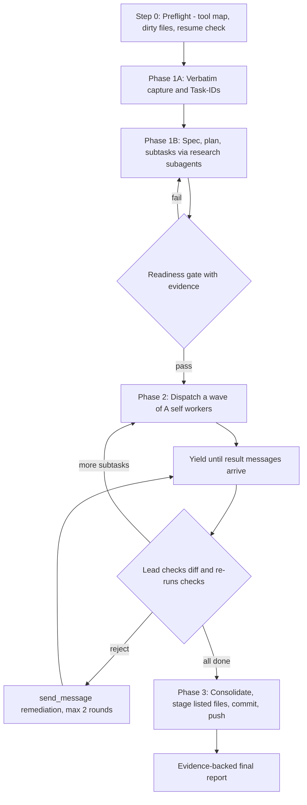

# Plan 15: Execute Parent Task N-Steps V4 (Antigravity-Native Rewrite)

- **Status:** IMPLEMENTED (S1 to S6 done). The plan stays pending until V4 runs in a live Antigravity session (follow-up 1).
- **Created:** 2026-10-01
- **Source prompt (V3):** [01-prompts/14-execute/10-execute-parent-task-with-n-steps-v3.md](../../../01-prompts/14-execute/10-execute-parent-task-with-n-steps-v3.md)
- **Target prompt (V4):** [01-prompts/14-execute/11-execute-parent-task-with-n-steps-v4.md](../../../01-prompts/14-execute/11-execute-parent-task-with-n-steps-v4.md)
- **Chosen approach:** B, an Antigravity-native rewrite in one self-contained file (chosen by the user during plan review).
- **Git scope:** one commit pushed to `main`. No release, no `version.json` edit, no sibling-repo rollout.
- **Open questions:** [02-execute-v4-open-conventions.md](../../ambiguous-questions/01-new-ambiguity/02-execute-v4-open-conventions.md)

---

## 1. User Request (Verbatim)

```text
01-prompts\14-execute\10-execute-parent-task-with-n-steps-v3.md

Okay. I want you to follow through and try to understand that coding guideline, all the prompts and skills, that's the first thing. Second, I want you to create a detailed plan. That detailed plan, I want you to write into the specific plan folder for that code base. So usually, code base has a plan folder where it needs to be written. Here, the idea is that you make a detailed plan. That detailed plan will consist of-- The detailed plan consists of improving the prompts folder especially. So I do have a plan. Especially, the execute folder. Execute parent task in steps. Okay. That has V3. Okay, I'm just going to give you the file path. Your job is to first read other prompts as well, especially this one. So I want you to understand this and think of better ways to enhance this prompt for anti-gravity, especially anti-gravity. So for this reason, you can write the detailed approach. If you think of multiple approaches, you can write that multiple approaches in the plan mode first, and then I want you to create another version of the execute parent task with NS steps V4. Okay, that would be the enhanced version that you think how this can be the best of the best without hallucination and following every step. Again, this prompt is for anti-gravity. So keeping that in mind, how can you improve it? Can you please do this for me?
```

Decisions from plan review:

- Approach: the Antigravity-native rewrite (Approach B below).
- Git: "push to current branch". The current branch is `main`.

Extracted tasks:

- **Task-01:** Understand the coding guidelines, the prompts, and the skills, especially V3.
- **Task-02:** Write a detailed plan with multiple approaches for improving the prompts folder, especially `01-prompts/14-execute/`, into the plan folder.
- **Task-03:** Create V4 of the execute-parent-task-with-n-steps prompt for Antigravity: no hallucination, every step followed.
- **Task-04:** Push the result to the current branch.

## 2. What Was Read

- **Coding guidelines:** the canonical `02-spec/17-consolidated-guidelines/34-compiled-simple-coding-guidelines.md`, its mirror [.ai-memory/coding-guidelines.md](../../coding-guidelines.md), [.ai-memory/strictly-avoid.md](../../strictly-avoid.md), `.cursorrules`, the workspace agent rules, and the 13 rule files in `.agents/rules/`.
- **Execute prompts:** V3 line by line. V1 (`02-`), V2 (`06-`), the old variant (`08-`), and the below-steps variant (`09-`) compared section by section with V3. The pending-task, batched-loop, and instruction-writer prompts (`01-`, `03-`, `04-`, `05-`, `07-`) surveyed for shared conventions.
- **Skills:** the three full copies of V3 (`.agents/skills/execute-parent-task-with-n-steps-v3/skill.md`, `.agents/skills/execute-parent-task-with-n-steps/skill.md`, `.agents/skills/parent-task-n-step-loop/skill.md`, 554 lines each), `.agents/skills/parent-task-in-below-steps/skill.md`, `.agents/skills/execute-parent-task/skill.md`, and the thin pointers in `.cursor/skills/`.
- **Tools the prompts call:** `03-ai-scripts/05-guideline-autofixer.py`, `03-ai-scripts/02-shared-engine.py`, `03-ai-scripts/33-test-inventory-generator.py`, the discovery scripts `11`, `12`, `17`, and `18` in `03-ai-scripts/`, and the prompt linters in `linter-scripts/`.
- **Antigravity 2.0 docs (checked 2026-09-30):** [Custom subagents](https://antigravity.google/docs/subagents/), [Hooks](https://www.antigravity.google/docs/hooks/), [I/O 2026 feature deep dive](https://antigravity.google/blog/google-io-2026-feature-deep-dive).

## 3. V3 Audit (Defects With Evidence)

Line numbers refer to V3.

1. **D1: Invalid subagent payload.** Evidence: L239 and L245 add `"Model": "inherit"`. An `invoke_subagent` entry has only `TypeName`, `Role`, `Prompt`, and an optional `Workspace`; the model tier is set in a custom agent's frontmatter. V4 fix: a corrected payload with short roles and an explicit `Workspace`.
2. **D2: Build and test contradiction.** Evidence: builds and test suites are banned at L22, L269, L290, L291, L500, L501, and L536, but the closing block at L548 demands "run builds and full unit tests". V4 fix: one rule (R1), and the closing block keeps the user's wording except that clause.
3. **D3: A file check that can pass without checking anything.** Evidence: L270 runs `python 03-ai-scripts/05-guideline-autofixer.py <file>`. Without `--check-only` the script rewrites files. Its positional argument is documented as a directory, and the engine in `03-ai-scripts/02-shared-engine.py` streams a single file only when it is already in the repo cache; otherwise `os.walk` on a file path yields nothing, so a new file is reported as "All 0 files ... clean" with exit 0. V4 fix: folder scope, `--check-only`, and "0 files scanned is a FAIL".
4. **D4: Unrelated files swept into commits.** Evidence: `git add -A` at L355, L537, and L543; L312 documents that `gitmap cpf` stages all files. V4 fix: stage by explicit path from the ledger; `gitmap cpf` only when the tree was clean at preflight.
5. **D5: Generated code committed.** Evidence: L491 runs `go generate ./...` and commits the output, against Hard Rule 1. V4 fix: generators run only when a spec requires them, and generated artifacts are never committed (R15).
6. **D6: Instructions the agent cannot follow, or that rely on undocumented behavior.** Evidence: L110 says "Override any planning mode stop directives", but the Artifact Review Policy is a user setting. L286 proves disjoint files "using `.ai-memory/readme.md`", which has no ownership or lock content. L36, L37, and L281 to L284 name a `<SYSTEM_MESSAGE>` wakeup tag that the docs do not describe. V4 fix: a review-policy note, an ownership map in the ledger, and "results arrive as messages" without naming a tag.
7. **D7: A self-installing skill that caused drift.** Evidence: Phase 0 (L81 to L87) tells the agent to copy the prompt into `.agents/skills/<slug>/skill.md` when missing; the repo now holds three 554-line copies of V3. V4 fix: no self-install; V4 ships with a thin pointer skill.
8. **D8: No path for ambiguity.** Evidence: the zero-question mandate at L110 and L214 to L218 forbids every question, including blocking ones. V4 fix: R14 separates non-blocking ambiguity (assume, log, continue) from blocking ambiguity (ask once, keep working on unblocked tasks).
9. **D9: The solo fallback contradicts the zero-solo gate, and nothing covers a missing tool.** Evidence: L288 lets the lead "execute the subtask directly", while L33 and L34 make solo execution an auto-reject. V4 fix: a capability preflight; the only solo path is a logged `SOLO_FALLBACK` when `invoke_subagent` is absent; fixes go back to the same worker through `send_message`.
10. **D10: No step accounting or resume for N = 300.** Evidence: nothing defines a step, and the per-task `state.md` files (L325 to L337) track workers, not the orchestrator. V4 fix: a step definition, a lead ledger, and resume from that ledger.
11. **D11: Index bloat.** Evidence: L534 adds every new file to `.ai-memory/what-to-read.md`. V4 fix: add only material future agents must read before a task.
12. **D12: A guessed confidence score and a noisy placeholder check.** Evidence: L396 suggests "98% or 100%", and L533 searches for `\[.*\]`, which matches every markdown link. V4 fix: confidence = evidence-backed checklist items / total items; the placeholder check looks for unfilled template tokens.
13. **D13: Repetition.** Evidence: the build and test ban appears 7 times, the atomic-commit rule 5 times (L349 to L356, L504, L537, L543, L544), GitMap command lists 3 times (L55 to L77, L168 to L173, L304 to L321), and the top-instruction mandate 4 times (L18 to L20, L24, L98, L496). V4 fix: each rule stated once with an ID.
14. **D14: Boolean prefix drift.** Evidence: L520 allows only `is` and `has`, while `.cursorrules` Quick Rule 2 also lists `can`, `should`, `was`, and `will`. V4 fix: defer to `.ai-memory/coding-guidelines.md` instead of restating it; the drift is logged as an open question.

## 4. Antigravity 2.0 Capabilities V4 Uses

- `invoke_subagent` spawns concurrent subagents: the built-in `research` type (read-only codebase exploration), `self` (a clone of the caller with the same tools), `browser` (only through `/browser`), and custom agents defined in `.agents/agents/`.
- Workspace modes: `inherit` (default), `branch` (an isolated git worktree the parent must merge), and `share`.
- Subagents start with a clean context, so every brief must be self-contained.
- Lifecycle: running, idle (keeps its context and wakes on a message), and killed. Results reach the parent as messages, so polling is never needed.
- Permissions are inherited, and approval requests bubble up to the user.
- Nesting is capped at 10 levels. V4 workers are told not to spawn their own subagents.
- Skills in `.agents/skills/<name>/` replace workflows, which retire on 2026-11-01. Skills can be invoked with a slash command.
- Hooks (`PreToolUse`, `PostToolUse`, `PreInvocation`, `PostInvocation`, `Stop`) are configured in a hooks JSON file, per workspace or globally. A `PreToolUse` decision of `deny` blocks the tool call.
- The Artifact Review Policy decides whether the platform pauses for plan approval ("Request Review") or continues ("Always Proceed").
- Older builds expose `task_boundary` and `notify_user` instead of artifact metadata and `ask_question`. V4 uses whichever the tool list contains.

## 5. Approaches Considered

### Approach A: Harden V3 in place

- **What:** keep V3's structure, headings, and length (548 lines), and fix D1 to D14 inline.
- **Pros:** the smallest diff; familiar to anyone who used V3.
- **Cons:** keeps the repetition and the length that make agents skip rules; the fixes stay scattered.
- **Verdict:** not chosen.

### Approach B: Antigravity-native rewrite in one file (chosen)

- **What:** a new file of 300 lines or fewer. Rules R1 to R15 are stated once and cited by ID. It adds a capability preflight, a resumable lead ledger, `research` subagents for discovery and `self` subagents for edits, lead verification of every worker report, and an evidence-backed final checklist.
- **Pros:** shorter and unambiguous; matches the current Antigravity tools; every claim needs proof; still pasteable as one prompt.
- **Cons:** V3 users must relearn section names; not yet run in a live Antigravity session.
- **Verdict:** chosen by the user.

### Approach C: Modular skill bundle

- **What:** a short `/execute-parent-task-with-n-steps-v4` skill plus `references/` files for the templates (worker brief, report, checklist), loaded on demand.
- **Pros:** follows the workflow-to-skills migration and progressive disclosure; the smallest always-loaded context.
- **Cons:** cannot be pasted as one prompt; the sync scripts and the prompt index expect single files; more files to keep in step.
- **Verdict:** not chosen. Revisit if pasted prompts stop being the main way this prompt is used.

### Approach D: Deterministic enforcement with hooks (follow-up)

- **What:** a workspace `PreToolUse` hook that denies `run_command` calls matching build or test commands, and a `Stop` hook that refuses to end the run while the ledger has open Task-IDs.
- **Pros:** enforcement no longer depends on the model reading the prompt.
- **Cons:** it applies to every Antigravity session in the workspace, including release and CI-fix work that legitimately builds; a faulty hook script affects every matching tool call.
- **Verdict:** follow-up, opt-in only, with an explicit allow switch for release work.

### Approach E: Hand off to `/teamwork-preview`

- **What:** let Antigravity's built-in multi-agent team do the orchestration, with the repo conventions passed as instructions.
- **Pros:** platform-managed milestones, parallel work, and verification.
- **Cons:** a preview feature on paid plans only; no control over the repo's spec, plan, and ledger conventions or over staging; behavior can change without notice.
- **Verdict:** rejected for this prompt.

## 6. Options for the Rest of the Execute Folder (Not in This Change)

- **F1: Archive superseded prompts.** Move V1 (`02-`), V2 (`06-`), and the old variant (`08-excute-parent-old.md`, whose name also has a typo) to `06-old-prompts/`, and add a lineage note to `01-prompts/readme.md`. This needs its own plan: moving files breaks index rows, skills, and sibling repos that sync `01-prompts/`.
- **F2: Shared execute core.** Move the RCA routing, commit protocol, and report templates into one reference file that every execute prompt links to. This removes duplication, but the prompts stop being pasteable on their own.
- **F3: Collapse the three V3 skill copies.** Replace the 554-line copies with thin pointers like the V4 skill, so they cannot drift from the prompt.
- **F4: Prompt-contract linter.** A check in `linter-scripts/` that fails on known-bad patterns in `01-prompts/` and `.agents/skills/`: a `"Model"` key in an `invoke_subagent` payload, `git add -A`, committing `go generate` output, or `05-guideline-autofixer.py` without `--check-only`. V1 to V3 would need an allowlist.

## 7. V4 Design Summary



V4 sections, in order:

1. Parameters (`N`, `A`, `H`, `COMMIT`), with N as a ceiling and one step defined as one lead tool-call round.
2. A single precedence ladder: the user's instructions, then platform limits, then repo rules, then the prompt.
3. Rules R1 to R15, stated once.
4. Step 0 preflight: tool map, script map, tree state, context, resume check, and review policy. The results go into the gitignored ledger that Phase 1A creates.
5. Phase 1A: verbatim capture, screenshots, Task-IDs, numbering, and V3's Confirmed Task Breakdown format, with the ledger written in the same response.
6. Phase 1B: lead blueprint, `research` discovery, spec, plan, lean subtasks, artifacts, and a readiness gate with evidence.
7. Phase 2: waves, the corrected payload, a self-contained worker brief with a fixed report block, yield without polling, lead acceptance, remediation, and resume.
8. Phase 3: consolidation, index rules, explicit-path staging, one commit, and push according to `COMMIT`.
9. The final report (V3's format, with step counts from the ledger and evidence-based confidence) and the independent audit prompt.
10. Targeted checks, discovery tools, RCA routing, the final checklist, and the user's closing block.

## 8. Subtask Ledger

### S1: Write this plan (Task-01, Task-02)

- **Owned files:** `.ai-memory/plans/pending/15-execute-parent-task-v4-antigravity.md`
- **Acceptance:** verbatim request, V3 audit with line evidence, Approaches A to E, options F1 to F4, this ledger, and follow-ups.
- **Verification:** `python linter-scripts/check-sequence-integrity.py` exits 0.
- **Status:** DONE. Evidence: `check-sequence-integrity.py` exit 0 (107 documents audited); the plan is 207 lines.

### S2: Author V4 (Task-03)

- **Owned files:** [01-prompts/14-execute/11-execute-parent-task-with-n-steps-v4.md](../../../01-prompts/14-execute/11-execute-parent-task-with-n-steps-v4.md)
- **Acceptance:** 300 lines or fewer; a fix for each of D1 to D14; none of the banned patterns (`"Model"`, `git add -A`, `go generate`, the autofixer without `--check-only`); none of the repo's forbidden phrases.
- **Verification:** line count, `python linter-scripts/check-prompt-and-spec-paths.py`, `python linter-scripts/check-forbidden-strings.py`, and a banned-pattern search.
- **Status:** DONE. Evidence: 263 lines; both linters exit 0. The banned-pattern search finds only R11's own rule text naming `file:///` URIs, and the autofixer's single use (V4 L226) carries `--check-only`. Each defect maps to a V4 fix, for example D1 at L137 to L138, D3 at L36 and L226, D9 at L39 and L170, D11 at L177, and D12 at L202 and L251.

### S3: Skill pointers (Task-03)

- **Owned files:** `.agents/skills/execute-parent-task-with-n-steps-v4/skill.md`, `.cursor/skills/execute-parent-task-with-n-steps-v4/skill.md`
- **Acceptance:** the frontmatter `name` matches the folder name; the body points to the V4 prompt and copies none of it.
- **Verification:** `python linter-scripts/check-prompt-and-spec-paths.py` and `python linter-scripts/check-sequence-integrity.py` exit 0.
- **Status:** DONE. Evidence: both files declare `name: execute-parent-task-with-n-steps-v4`, matching their folders; they are 17 and 20 lines of pointer text; both linters exit 0.

### S4: Index registration (Task-03)

- **Owned files:** `.ai-memory/prompts.md`, `01-prompts/readme.md`, `.ai-memory/plans/readme.md`, `.ai-memory/what-to-read.md`
- **Acceptance:** a V4 row in the prompt index, item 7 in the prompts readme, plan 15 under Pending Plans, and a changelog line with an updated "Last updated".
- **Verification:** `python linter-scripts/check-prompts-loaded.py` exits 0.
- **Status:** DONE. Evidence: `check-prompts-loaded.py` exit 0 ("Prompt index is in sync", 161 prompts on disk).

### S5: Open questions (Task-01)

- **Owned files:** `.ai-memory/ambiguous-questions/01-new-ambiguity/02-execute-v4-open-conventions.md`
- **Acceptance:** three questions (skill file casing, screenshot folder, boolean prefixes), each with options and the impact of guessing wrong.
- **Verification:** `python linter-scripts/check-sequence-integrity.py` exits 0.
- **Status:** DONE. Evidence: the note is 44 lines and holds all three questions, each with options and the impact of guessing wrong; `check-sequence-integrity.py` exit 0.

### S6: Verify, commit, push (Task-04)

- **Owned files:** the git index only.
- **Acceptance:** the four prompt linters exit 0; the staged list equals the nine files of S1 to S5; one commit; pushed to `origin main`.
- **Verification:** `git diff --cached --name-only`, then `git status` and `git log -1` after the push.
- **Status:** DONE. Evidence: the four linters exit 0, and the tree before staging held exactly the nine files. This commit cannot hold its own hash, so `git log origin/main -1` is the record of the commit and push.

## 9. Acceptance Criteria (Whole Change)

- V4 exists, is 300 lines or fewer, and fixes each of D1 to D14.
- V4 is registered everywhere V3 is: the prompt index, the prompts readme, and thin pointer skills for Antigravity and Cursor.
- The V3 prompt, its skills, and the unversioned alias skills are unchanged.
- `check-prompts-loaded.py`, `check-prompt-and-spec-paths.py`, `check-sequence-integrity.py`, and `check-forbidden-strings.py` all exit 0.
- No builds or test suites were run, and nothing outside the nine files was staged.

## 10. Follow-ups

1. Run V4 in a live Antigravity session on a small real task, and record any tool-name or behavior mismatch in this plan (owner: user).
2. After a successful run, point the unversioned alias skills (`.agents/skills/execute-parent-task-with-n-steps/skill.md` and its `.cursor/skills/` twin) at V4.
3. Roll V4 out to the sibling repos with a V4 variant of `03-ai-scripts/42-sync-v3-prompts-and-skills.py`, only on an explicit command.
4. Approach D (hooks), opt-in only.
5. Options F1 to F4.
6. Index drift found during onboarding: `.ai-memory/what-to-read.md` lists the version standard without its `04-` prefix and the open-questions folder under an old name (the real folder is `ambiguous-questions/`), and the pending plan `05-ai-adaptable-design-system.md` is missing from `.ai-memory/plans/readme.md`.
