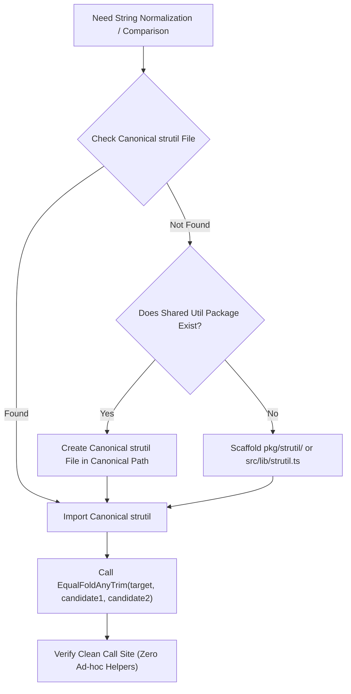
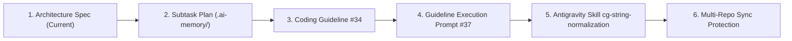

# Architecture Specification: Centralized String Normalization, `EqualFoldAnyTrim` Utility Standard & Canonical Location Discovery Protocol

> **/goal** Eliminate maintenance friction, redundant allocations, and cognitive bloat caused by repeated string normalization (`ToLower`, `TrimSpace`) and chained equality checks (`EqualFold(s, "y") || EqualFold(s, "yes")`) by standardizing a centralized, variadic string utility function (`EqualFoldAnyTrim` / `EqualFoldAny`) and establishing a strict "Search First" canonical location discovery protocol for AI agents and human developers.
> **/learn** Master the anti-patterns of inline string trimming and chained comparison cascades, implement high-performance zero-allocation case-folding matching across Go, TypeScript, Rust, and Python, enforce the canonical package location protocol (`pkg/strutil/strutil.go`, `src/lib/strutil.ts`, `src/util/strutil.rs`, `pkg/strutil/strutil.py`), and prepare the specification and task roadmap for repository-wide adoption.

**Version:** 1.0.0  
**Updated:** 2026-10-02  
**Status:** Active  
**AI Confidence:** Production-Ready  
**Ambiguity:** None  

---

## 1. Executive Summary & Core Motivation

Across polyglot systems and command-line interfaces, evaluating whether a user input or runtime token matches one of several acceptable candidate values is one of the most common control-flow operations:

```go
// Common confirmation prompt in CLI tools:
reply := getUserInput()
trimmed := strings.TrimSpace(reply)
if strings.EqualFold(trimmed, "y") || strings.EqualFold(trimmed, "yes") {
    // proceed
}
```

While functional on the surface, this ubiquitous idiom introduces severe architectural and operational friction when repeated across codebases:

### 1.1 Redundant Allocations & Computational Waste
In garbage-collected runtimes like Go and Python, functions such as `strings.ToLower()` or `str.lower()` allocate brand-new string objects on the heap. Even when using case-insensitive comparators like Go's `strings.EqualFold()`, callers routinely pair it with repeated `strings.TrimSpace()` invocations. When multiple candidate values are checked (`"y"`, `"yes"`, `"true"`, `"1"`, `"ok"`), developers either allocate intermediate transformed strings or redundantly call string manipulation routines inside multi-branch expressions.

### 1.2 Cognitive Bloat & Call-Site Clutter
Chained boolean expressions using logical OR (`||`) obscure the developer's core business intent behind layers of mechanical boilerplate:
- In Go: `strings.EqualFold(trimmed, "y") || strings.EqualFold(trimmed, "yes") || strings.EqualFold(trimmed, "true")`
- In TypeScript: `input.trim().toLowerCase() === 'y' || input.trim().toLowerCase() === 'yes' || input.trim().toLowerCase() === 'true'`
- In Rust: `s.trim().eq_ignore_ascii_case("y") || s.trim().eq_ignore_ascii_case("yes")`
- In Python: `s.strip().lower() == "y" or s.strip().lower() == "yes" or s.strip().lower() == "true"`

Every additional candidate expands the horizontal width and cyclomatic complexity of the condition, increasing the surface area for bugs and making code reviews noisy.

### 1.3 Asymmetry & Inconsistent Edge-Case Handling
Because individual developers implement string checks ad-hoc at each call site, inconsistencies proliferate:
- Developer A trims whitespace but performs case-sensitive matching (`trimmed == "y"`).
- Developer B performs case-insensitive matching but forgets to trim whitespace (`strings.EqualFold(raw, "y")`).
- Developer C trims whitespace on the first check but accidentally evaluates raw input on the second candidate (`EqualFold(trimmed, "y") || EqualFold(raw, "yes")`).
- Developer D checks Unicode casing incorrectly across diverse locales.

### 1.4 Code Duplication & Re-Invention Fatigue
Without a recognized canonical utility, AI agents and engineers repeatedly author one-off helper functions inside individual command files (e.g., `isYes(s string) bool`, `matchesAny(val string, opts []string) bool`, `checkConfirm(str string) bool`). This fragments the codebase into dozens of incompatible, unshared, micro-helpers that violate the DRY (Don't Repeat Yourself) principle.

---

## 2. The Solution: `EqualFoldAnyTrim` & `EqualFoldAny`

To systematically resolve these deficiencies across all supported languages, this specification establishes a centralized utility function family anchored around `EqualFoldAnyTrim` and `EqualFoldAny`.

### 2.1 Function Signature & Variadic Design

The signature strictly adheres to the **Variadic & Spread Parameter standard** codified in `02-spec/02-coding-guidelines/01-cross-language/33-variadic-and-spread-parameters.md`:

- **Target-First:** The primary string being inspected is passed as the first parameter.
- **Variadic Candidates:** Candidate matching strings are passed as trailing variadic arguments (`...string` in Go, `...candidates: readonly string[]` in TypeScript, `&[&str]` in Rust, `*candidates: str` in Python).
- **Zero-Wrapper Single & Multi Calls:** Callers can check 1, 2, or 10 candidates with clean comma separation, or unpack an existing slice using the spread operator (`candidates...`).

```go
// Go: Centralized definition in pkg/strutil
package strutil

// EqualFoldAny reports whether target matches any candidate under Unicode case-folding.
func EqualFoldAny(target string, candidates ...string) bool

// EqualFoldAnyTrim reports whether target, with leading and trailing whitespace
// removed, matches any candidate under Unicode case-folding.
func EqualFoldAnyTrim(target string, candidates ...string) bool
```

### 2.2 Internal Mechanics & Zero-Allocation Efficiency

The canonical implementation of `EqualFoldAnyTrim` executes with optimal performance:

1. **Single Upfront Normalization:** The target string is trimmed once (`strings.TrimSpace(target)`).
2. **Short-Circuiting Evaluation:** Iteration over candidates terminates immediately upon the first match, returning `true` without evaluating remaining candidates.
3. **Empty Collection Safety:** If zero candidates are supplied, the function returns `false` cleanly without panic.
4. **Zero Intermediate Slice Construction:** When candidates are supplied as literals, compiler optimizations eliminate temporary heap allocation of slice headers where possible.

---

## 3. The "Search First" Canonical Location Discovery Protocol

To stop the recurring proliferation of duplicate helper functions authored by AI agents across scattered packages, all agents operating within Prompt Architect managed repositories MUST follow the **Search First Protocol**.

### 3.1 Canonical Location Directory Table

| Language | Primary Canonical Path | Permitted Internal Path | Prohibited Ad-Hoc Paths |
|:---|:---|:---|:---|
| **Go** | `pkg/strutil/strutil.go` | `internal/strutil/strutil.go` | `cmd/*.go`, `pkg/util/helpers.go`, inline file helpers |
| **TypeScript** | `src/lib/strutil.ts` | `src/utils/strutil.ts` | `src/components/*.tsx`, `src/pages/*.ts`, local `helpers.ts` |
| **Rust** | `src/util/strutil.rs` | `src/strutil/mod.rs` | `src/main.rs`, inline sub-modules in `src/cmd/` |
| **Python** | `pkg/strutil/strutil.py` | `src/strutil.py` | `scripts/*.py`, inline functions in individual script files |

### 3.2 Protocol Execution Flow for AI Agents



### 3.3 Strict Ban on Local Duplicate Helpers

AI agents are **STRICTLY FORBIDDEN** from authoring private, unshared functions that perform case-folding checks, such as:
- `func isYes(s string) bool` in `cmd/releaseundo.go`
- `func checkAnswer(a string) bool` in `pkg/cli/prompt.go`
- `const isAffirmative = (s: string) => ...` in `src/utils/confirm.ts`

If a string comparison operation is needed in more than one place, or represents general equality folding, it MUST reside in the canonical `strutil` package.

---

## 4. Real-World Case Study: `releaseundo.go`

A prime example of this anti-pattern is found in production CLI implementations such as `cli/cmd/releaseundo.go` (from the `gitmap` repository).

### 4.1 The Anti-Pattern (`cli/cmd/releaseundo.go`)

```go
// ❌ ANTI-PATTERN: Ad-hoc TrimSpace and chained EqualFold
// Located in cli/cmd/releaseundo.go (lines 91-99)
func confirmUndoRelease(tag string) bool {
	fmt.Printf("Delete %s locally and on origin? [y/N]: ", tag)
	var reply string
	_, _ = fmt.Scanln(&reply)
	trimmed := strings.TrimSpace(reply)

	return strings.EqualFold(trimmed, "y") || strings.EqualFold(trimmed, "yes")
}
```

#### Deficiencies in this implementation:
1. **Redundant variable declaration:** `trimmed` is declared solely to feed two successive `strings.EqualFold()` calls.
2. **Horizontal expansion:** If the CLI needs to support `"true"`, `"1"`, or localized equivalents (`"oui"`, `"ja"`), the `||` chain multiplies linearly.
3. **Zero reusability:** Any other command requiring user confirmation (`gitmap reset`, `gitmap clean`, `gitmap sync`) must copy-paste this identical logic or create a divergent variant.

### 4.2 The Canonical Solution

```go
// ✅ CANONICAL PATTERN: High-signal, single-line call to centralized strutil
// In cli/cmd/releaseundo.go:
package cmd

import (
	"fmt"
	"strings"

	"github.com/alimtvnetwork/gitmap-v28/cli/pkg/strutil"
)

func confirmUndoRelease(tag string) bool {
	fmt.Printf("Delete %s locally and on origin? [y/N]: ", tag)
	var reply string
	_, _ = fmt.Scanln(&reply)

	return strutil.EqualFoldAnyTrim(reply, "y", "yes")
}
```

#### Canonical Package Implementation (`cli/pkg/strutil/strutil.go`):

```go
package strutil

import "strings"

// EqualFoldAny reports whether target matches any candidate under Unicode case-folding.
func EqualFoldAny(target string, candidates ...string) bool {
	for _, candidate := range candidates {
		isMatch := strings.EqualFold(target, candidate)
		if isMatch {
			return true
		}
	}

	return false
}

// EqualFoldAnyTrim reports whether target (after trimming leading/trailing whitespace)
// matches any candidate under Unicode case-folding.
func EqualFoldAnyTrim(target string, candidates ...string) bool {
	trimmed := strings.TrimSpace(target)

	return EqualFoldAny(trimmed, candidates...)
}

// TrimLower returns the string stripped of leading and trailing whitespace
// and converted to lower case.
func TrimLower(s string) string {
	return strings.ToLower(strings.TrimSpace(s))
}
```

---

## 5. Cross-Language Architectural Principles & Implementations

### 5.1 TypeScript (`src/lib/strutil.ts`)

#### ❌ Anti-Pattern: Chained Inline Checks
```typescript
// ❌ ANTI-PATTERN: Inefficient repeated method chaining
function isAffirmativeInput(input: string): boolean {
  const clean = input.trim().toLowerCase();
  return clean === 'y' || clean === 'yes' || clean === 'true' || clean === '1';
}
```

#### ✅ Canonical Implementation & Usage
```typescript
// ✅ CANONICAL: src/lib/strutil.ts
export function equalFoldAny(
  target: string,
  ...candidates: readonly string[]
): boolean {
  const normalizedTarget = target.toLowerCase();

  for (const candidate of candidates) {
    const isMatch = normalizedTarget === candidate.toLowerCase();
    if (isMatch) {
      return true;
    }
  }

  return false;
}

export function equalFoldAnyTrim(
  target: string,
  ...candidates: readonly string[]
): boolean {
  const trimmed = target.trim();

  return equalFoldAny(trimmed, ...candidates);
}

// Call site:
const isConfirmed = equalFoldAnyTrim(userPrompt, 'y', 'yes');
const isFlagActive = equalFoldAnyTrim(envValue, '1', 'true', 'on', 'enabled');
```

---

### 5.2 Rust (`src/util/strutil.rs`)

#### ❌ Anti-Pattern: Verbose Match Arms or Repeated Chaining
```rust
// ❌ ANTI-PATTERN: Redundant string allocations and match boilerplate
fn is_confirmed(reply: &str) -> bool {
    let trimmed = reply.trim();
    trimmed.eq_ignore_ascii_case("y") || trimmed.eq_ignore_ascii_case("yes")
}
```

#### ✅ Canonical Implementation & Usage
```rust
// ✅ CANONICAL: src/util/strutil.rs
pub fn equal_fold_any(target: &str, candidates: &[&str]) -> bool {
    for candidate in candidates {
        let is_match = target.eq_ignore_ascii_case(candidate);
        if is_match {
            return true;
        }
    }

    false
}

pub fn equal_fold_any_trim(target: &str, candidates: &[&str]) -> bool {
    let trimmed = target.trim();

    equal_fold_any(trimmed, candidates)
}

// Call site:
let is_confirmed = equal_fold_any_trim(reply, &["y", "yes"]);
```

---

### 5.3 Python (`pkg/strutil/strutil.py`)

#### ❌ Anti-Pattern: Inlined Membership with Repeated Transforms
```python
# ❌ ANTI-PATTERN: Re-transforming or repetitive chaining
def is_affirmative(reply: str) -> bool:
    return reply.strip().lower() in ("y", "yes", "true", "1")
```

#### ✅ Canonical Implementation & Usage
```python
# ✅ CANONICAL: pkg/strutil/strutil.py
def equal_fold_any(target: str, *candidates: str) -> bool:
    """Report whether target matches any candidate case-insensitively."""
    normalized_target = target.casefold()

    for candidate in candidates:
        is_match = normalized_target == candidate.casefold()
        if is_match:
            return True

    return False


def equal_fold_any_trim(target: str, *candidates: str) -> bool:
    """Report whether trimmed target matches any candidate case-insensitively."""
    trimmed = target.strip()

    return equal_fold_any(trimmed, *candidates)


# Call site:
is_confirmed = equal_fold_any_trim(reply, "y", "yes")
```

---

## 6. Comprehensive Good vs Bad Contrast Matrix

| Attribute | ❌ Ad-Hoc Inline Chaining (`EqualFold(s, "y") \|\| ...`) | ✅ Centralized `EqualFoldAnyTrim(s, ...)` | Architectural Benefit |
|:---|:---|:---|:---|
| **Call Site Readability** | High clutter; multiple `strings.EqualFold()` calls | Clean single-line function call: `strutil.EqualFoldAnyTrim(s, "y", "yes")` | Immediate clarity of intent; low cognitive load |
| **Maintenance & Extensibility** | Expanding candidates requires modifying boolean logic operators | Adding a candidate requires only adding a comma-separated argument | Minimal diff surface; zero risk of operator precedence errors |
| **Memory Allocation** | Often allocates new strings per candidate check | Trims once upfront; zero allocations during candidate comparison | Reduced GC pressure in high-throughput hot paths |
| **Whitespace Resilience** | Callers frequently forget `strings.TrimSpace()`, leading to subtle input bugs | Trimming is guaranteed and standardized internally | Immunity to trailing newlines, carriage returns, and spaces |
| **Reusability** | Logic re-implemented ad-hoc in every command, package, and handler | 100% centralized in canonical `strutil` package | Strict DRY adherence across all repository packages |
| **AI Agent Consistency** | AI models generate inconsistent helper variants (`isYes`, `checkMatch`, `validStr`) | AI models discover and invoke canonical `strutil` methods via Search First protocol | Deterministic code generation; zero codebase fragmentation |

---

## 7. Actionable Plan for Coding Guideline Specification #34

The cross-language coding guideline specification will be authored at:  
`02-spec/02-coding-guidelines/01-cross-language/34-string-normalization-and-equalfoldany.md`.

### Core Rules Codified in Guideline #34:

1. **R1: Centralized String Utility Primacy:** Banning ad-hoc chained string comparisons (`EqualFold(s, a) || EqualFold(s, b)`) across all application code.
2. **R2: Target-First Variadic Candidate Signature:** The inspected string must be the first parameter, followed by variadic candidate strings.
3. **R3: Upfront Normalization & Short-Circuiting:** The utility must trim whitespace once upfront and short-circuit on the first matching candidate.
4. **R4: Search First Protocol:** AI agents must query canonical locations (`pkg/strutil/strutil.go`, `src/lib/strutil.ts`, `src/util/strutil.rs`, `pkg/strutil/strutil.py`) before authoring any string utility.
5. **R5: Prompt Architect Boolean Hygiene:** Implicit checks only, positive prefixes (`isMatch`), zero explicit `== true`, and zero mixed polarity in conditional branches.
6. **R6: Strict Vertical Line Spacing:** Mandatory blank line before `if`, blank line after `}`, and blank line before `return`.

---

## 8. Implementation Blueprint for Meta-Repository Deliverables

To implement and enforce this standard across the meta-repository and connected repositories, the following deliverables are sequenced:



### Deliverable 1: Architecture Specification
- **Target File:** `02-spec/21-app/02-string-normalization-and-equalfoldany/01-architecture-spec.md` (this file)
- **Status:** Complete

### Deliverable 2: Subtask Plan
- **Target File:** `.ai-memory/plans/subtasks/02-string-normalization-and-equalfoldany/01-coding-guideline-equalfoldany.md`
- **Scope:** Complete roadmap and step-by-step checklist for authoring guideline #34.

### Deliverable 3: Cross-Language Coding Guideline #34
- **Target File:** `02-spec/02-coding-guidelines/01-cross-language/34-string-normalization-and-equalfoldany.md`
- **Scope:** Formal codification of rules R1 through R6, Good vs Bad matrices, polyglot examples, and registration in `readme.md`.

### Deliverable 4: Coding Guideline Execution Prompt #37
- **Target File:** `01-prompts/15-cg-execute/37-string-normalization-and-equalfoldany.md`
- **Scope:** Autonomous execution prompt adhering to V6 parameter headers (`N = 300, A = 2, H = 2, C = 30`) and multi-agent scanning.

### Deliverable 5: Native Antigravity Skill
- **Target File:** `.agents/skills/cg-string-normalization-and-equalfoldany/skill.md`
- **Scope:** Antigravity agent skill for AST scanning, finding chained equality checks, and refactoring to `strutil.EqualFoldAnyTrim`.

### Deliverable 6: Multi-Repository Synchronization
- **Target Script:** `03-ai-scripts/38-sync-prompts-skills-scripts.py`
- **Scope:** Incorporating new guideline, prompt, and skill into sync manifests across all connected repositories.

---

## 9. Verification & Acceptance Criteria

### AC-APP-016: String Normalization & EqualFoldAny Architecture Verification

**Given** The architecture spec and subtask plans are authored in their canonical locations.  
**When** Linters and path verifiers are executed across the repository.  
**Then**
1. All file paths are strictly relative starting from the repository root (zero absolute paths or `file:///` URIs).
2. All filenames are strictly lowercase.
3. Code examples adhere to Prompt Architect guidelines (zero explicit `== true`, zero mixed polarity, vertical line gaps preserved).
4. Concrete examples feature the verbatim `cli/cmd/releaseundo.go` pattern and its canonical refactor.

**Verification commands:**
```bash
python linter-scripts/check-relative-paths.py
python 03-ai-scripts/21-sequence-integrity-linter.py 02-spec/21-app
```

**Expected Result:** Exit code 0 across all verification scripts.
