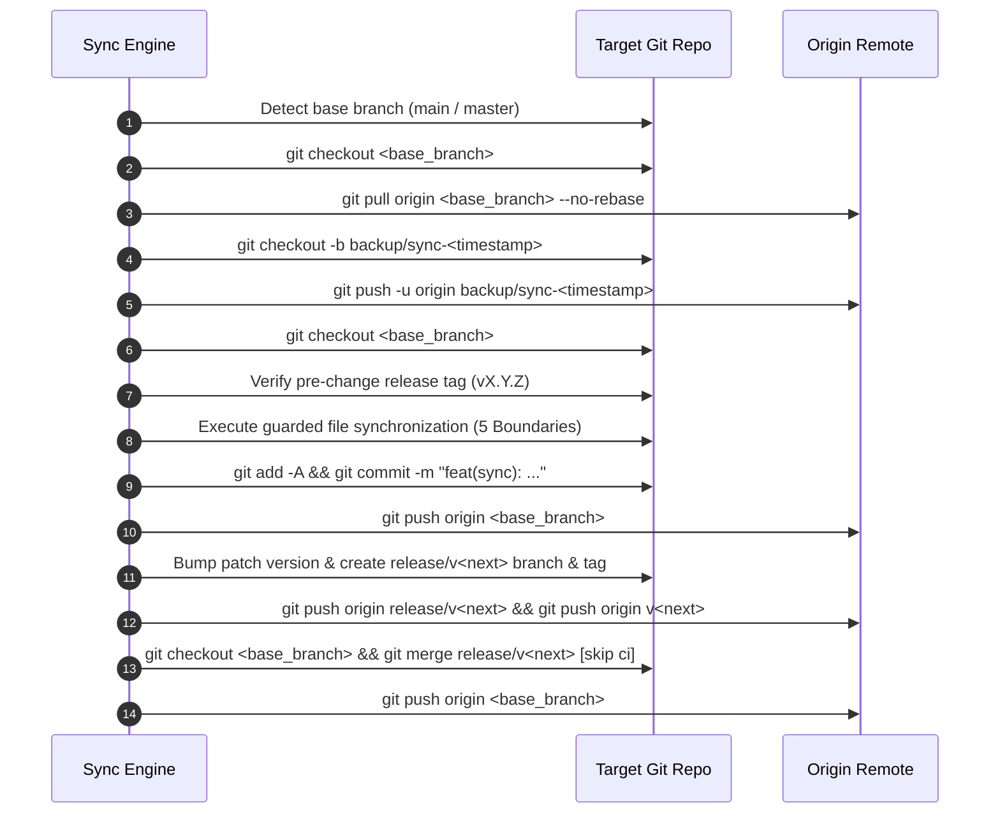

# Architecture Specification: Parameter-Driven Multi-Repository Synchronization Engine (V6 Architecture)

> **/goal** Establish a parameter-driven, zero-hardcoded-path multi-repository synchronization execute engine following V6 architecture that safely synchronizes prompts, skills, AI scripts, and coding guidelines while rigorously enforcing the 5 Non-Negotiable Boundaries.
> **/learn** Master the 5 Non-Negotiable Boundaries (Spec 21 Exclusion, Bump Script Protection, Additive-Only AI Scripts, Memory & Plans Protection, Zero Secret Keys Leakage), the pre-flight pull and backup branch ceremony, and dynamic parameter ingestion without hardcoded repository paths.

**Version:** 1.0.0  
**Updated:** 2026-10-02  
**Status:** Active  
**AI Confidence:** Production-Ready  
**Ambiguity:** None  
**Target Scope:** Meta-Repository (`coding-guidelines`) & Any Dynamically Configured Target Repositories  
**Reference Scripts:** `03-ai-scripts/38-sync-prompts-skills-scripts.py`, `03-ai-scripts/41-audit-all-repos.py`  
**Execution Category:** `01-prompts/23-sync/01-sync-other-codebase.md`  

---

## 1. Executive Summary & Core Motivation

The Prompt Architect meta-repository (`coding-guidelines`) acts as the canonical single source of truth for prompts (`01-prompts/`), agent skills (`.agents/skills/`, `.cursor/skills/`), shared automation scripts (`03-ai-scripts/`, `.agents/scripts/`), and cross-language coding guidelines (`02-spec/02-coding-guidelines/`).

In distributed engineering environments, organizations manage dozens of downstream repositories (e.g., CLI tools, microservices, frontends, documentation portals, and infrastructure packages). To maintain consistent agentic behaviors and architectural hygiene across all connected projects, automated synchronization is required.

However, historical synchronization tooling suffered from two fundamental limitations:
1. **Hardcoded Repository Paths:** Source and target repository lists were statically baked into Python scripts and prompt documents, creating brittle dependencies, requiring manual edits whenever a new repository was added or synced individually, and hindering flexible parameter-driven orchestration.
2. **Boundary Clobbering Hazards:** Unconstrained mirroring runs the risk of overwriting child-specific domain specifications (`02-spec/21-*`), overriding custom version bump routines, destroying modified scripts, wiping out child agent memory logs (`.ai-memory/memory/` and `.ai-memory/plans/`), or inadvertently copying sensitive environment credentials.

To permanently solve these challenges, this specification formalizes the **Parameter-Driven Multi-Repository Synchronization Engine** built on the **V6 Autonomous Execution Architecture** (`N = 300`, `A = 2`, `H = 2`, `C = 30`).

---

## 2. Zero Hardcoded Source/Target Paths Mandate

### 2.1 The Dynamic Parameter Protocol
All prompts, scripts, and skills operating within this synchronization domain MUST operate under a strict **Zero Hardcoded Paths Mandate**:
- The engine MUST NOT hardcode static file paths, workspace folders, or repository arrays in execution prompt bodies or automation runners.
- Both the source repository (`SOURCE_REPO`) and target repositories (`TARGET_REPOS`) MUST be dynamically supplied at invocation time by the user, orchestrator, or caller agent.
- If a parameter is omitted, the engine MUST fall back to safe dynamic discovery (e.g., current repository root as `SOURCE_REPO`, or querying discovered repositories relative to workspace root) rather than hardcoded string paths.

### 2.2 Parameter Definitions & Ingestion Schema

The synchronization engine accepts the following dynamic parameter block:

```text
SOURCE_REPO   = <path_or_dot>            # Source repository root (default: "." / current repository root)
TARGET_REPOS  = <repo1,repo2,...>        # Target repository path(s), names, or glob list (comma-separated or CLI flags)
WORKERS       = 6                        # Parallel worker threads (default: 6)
DRY_RUN       = false                    # Preview file copy/delete actions without disk mutation (default: false)
NO_PUSH       = false                    # Commit and tag locally without pushing to git remote (default: false)
```

### 2.3 CLI & Slash Command Invocation Syntax

The engine supports dynamic invocation through standard interfaces:

```bash
# 1. Antigravity Slash Command (Single Target)
/sync-other-codebase --source . --target ../movie-cli

# 2. Antigravity Slash Command (Multiple Targets with Parallel Workers)
/sync-other-codebase --source . --target "../movie-cli, ../gitmap, ../wp-exam" --workers 4

# 3. Dry-Run Verification Mode
/sync-other-codebase --source . --target ../movie-cli --dry-run

# 4. Direct Python Runner Invocation
python 03-ai-scripts/38-sync-prompts-skills-scripts.py --source . --repo movie-cli --workers 4

# 5. GitMap Command Invocation
gitmap sync --source . --target ../movie-cli
```

---

## 3. Lossless Verbatim Capture of User Request & Directives

### 3.1 User Directives (Verbatim)

The synchronization engine preserves and enforces 100% of the user's instructions:

> [!IMPORTANT]
> **User Sync Directive (Verbatim):**  
> *"When you synchronize with other repositories, few things you have to keep in mind. First of all, the spec 21 folder, you should not sync. Okay? If that has updates, you should leave it as it is. AI scripts. If we have the new AI scripts, it should put into there. That's fine. But if the existing script is modified by the repository itself, do not touch this. Okay? So also the bump script, do not modify bump script because the bump script can be updated using its repo's own stuff. So keep this in mind, and based on that, if you think the script needs to be updated, follow that. Follow that, and also update in your memory so that this never happens. Whenever I say sync, you should follow this through."*

> [!IMPORTANT]
> **Authoring Directive (Verbatim):**  
> *"You are Authoring Subagent 01 for task 03-sync-other-codebase.  
> Your job is to author:  
> 1. 02-spec/21-app/03-sync-other-codebase/01-architecture-spec.md  
> 2. .ai-memory/plans/subtasks/03-sync-other-codebase/01-sync-execute-prompt.md  
> Specifications to detail:  
> - Architecture specification covering:  
>   - Overview and purpose: A parameter-driven, zero-hardcoded-path multi-repository synchronization execute engine following V6 architecture.  
>   - Zero hardcoded source/target paths mandate: SOURCE_REPO and TARGET_REPOS are provided dynamically by caller/user.  
>   - Lossless Verbatim Capture of User Request and the user's provided "Sync Command" example.  
>   - The 5 Non-Negotiable Boundaries:  
>     1. Spec 21 Exclusion: NEVER sync or touch 02-spec/21-*.  
>     2. Bump Script Protection: NEVER overwrite version bump scripts (bump-version.mjs, bump_versions.py, 37-bump-version.py, etc.).  
>     3. Additive-Only AI Scripts: New AI scripts in 03-ai-scripts/ and .agents/scripts/ are copied, but existing modified scripts in target repos must NOT be overwritten blindly; diff and understand before modifying.  
>     4. Memory & Plans Protection: NEVER overwrite or delete .ai-memory/memory/ or .ai-memory/plans/ in target repos.  
>     5. Zero Secret Keys Leakage: NEVER sync .env or private credentials.  
>   - Pre-flight pull and backup branch ceremony: git pull origin <base_branch> --no-rebase, create and push backup/sync-<timestamp>.  
>   - Python script reference: 03-ai-scripts/38-sync-prompts-skills-scripts.py.  
> - Subtask plan 01:  
>   - Step-by-step instructions to create 01-prompts/23-sync/readme.md and 01-prompts/23-sync/01-sync-other-codebase.md following V6 engine (N=300, A=2, H=2, C=30, semicolon slash commands, R1-R16).  
> Strict relative git paths, strict lowercase filenames. Write these 2 files and report when done."*

---

## 4. The 5 Non-Negotiable Boundaries (TOTAL BANS & STRICT GUARDS)

```
┌─────────────────────────────────────────────────────────────────────────────┐
│                       SOURCE REPOSITORY (SOURCE_REPO)                       │
└──────────────────────────────────────┬──────────────────────────────────────┘
                                       │
                      SYNCHRONIZATION PIPELINE (V6 ENGINE)
                                       │
          ┌────────────────────────────┼────────────────────────────┐
          ▼                            ▼                            ▼
┌──────────────────┐         ┌──────────────────┐         ┌──────────────────┐
│   01-prompts/    │         │  .agents/skills/ │         │ 02-coding-guide/ │
│  (Clean Mirror)  │         │  (Clean Mirror)  │         │  (Clean Mirror)  │
└──────────────────┘         └──────────────────┘         └──────────────────┘
                                       │
                        STRICT BOUNDARY GUARDS (TOTAL BANS)
                                       │
  ┌──────────────┬───────────────┼───────────────┬──────────────┬──────────────┐
  ▼              ▼               ▼               ▼              ▼              ▼
BOUNDARY 1    BOUNDARY 2      BOUNDARY 3      BOUNDARY 4     BOUNDARY 5     OLD PROMPTS
Spec 21       Bump Scripts    Additive AI     Memory & Plans Zero Secrets   06-old-prompts
`02-spec/21-*` `*bump*`        `03-ai-scripts/` `.ai-memory/`   `.env*` / keys TOTAL BAN
NEVER sync    NEVER overwrite NEVER overwrite NEVER touch    NEVER leak     NEVER sync
```

### 4.1 Boundary 1: Spec 21 Exclusion (`02-spec/21-*`)
- **Prohibition:** NEVER synchronize, copy, touch, or mirror `02-spec/21-*` (including `02-spec/21-app`, `02-spec/21-app-issues`, `02-spec/21-app-db`, and `02-spec/21-app-ui-design-system`) between repositories.
- **Architectural Rationale:** `02-spec/21-*` defines project-specific domain models, REST API endpoints, business logic, and UI architectures. Pushing meta-repo specs into a target repo destroys that repository's domain models. Pushing child specs into the meta-repo corrupts central architecture indexes.
- **Code Enforcement:**
  ```python
  def is_spec_21(path: Path) -> bool:
      norm = str(path).replace("\\", "/").lower()

      if "/21-" in norm or "spec/21" in norm:
          return True

      for part in path.parts:
          if part.startswith("21-"):
              return True

      return False
  ```

### 4.2 Boundary 2: Bump Script Protection (`bump*`)
- **Prohibition:** NEVER overwrite, replace, or alter version bump scripts in target repositories (`bump-version.mjs`, `bump_versions.py`, `37-bump-version.py`, `scripts/bump*.js`, etc.).
- **Architectural Rationale:** Each repository manages its release lifecycle using stack-specific tooling (Node `package.json`, Python `version.json`/`pyproject.toml`, Go git tags, PHP `composer.json`). Overwriting a child repository's custom release script breaks automated deployment pipelines.
- **Code Enforcement:**
  ```python
  def is_bump_script(path: Path) -> bool:
      name = path.name.lower()
      is_bump = "bump" in name
      is_version = "version" in name or name.startswith("bump")

      if is_bump and is_version:
          return True

      return False
  ```
  If `is_bump_script(dst_file)` is true and `dst_file.exists()`, the file is skipped unconditionally.

### 4.3 Boundary 3: Additive-Only AI Scripts (`03-ai-scripts/`, `.agents/scripts/`)
- **Rule:** When synchronizing AI automation scripts:
  - **New scripts:** If a script exists in the source repository but is absent in the target repository (`not dst_file.exists()`), it is copied cleanly.
  - **Existing scripts:** If a script already exists in the target repository (`dst_file.exists()`), it MUST NOT be overwritten blindly. AI agents and scripts must diff and understand the modifications before altering them.
  - **Zero deletions:** Scripts residing in the target repository that do not exist in the source repository MUST NEVER be deleted.
- **Architectural Rationale:** Target repositories frequently adapt shared scripts for local database paths, container engines, or repo-specific CI environments. Blind overwrites destroy functional configurations.

### 4.4 Boundary 4: Memory & Plans Protection (`.ai-memory/memory/`, `.ai-memory/plans/`)
- **Prohibition:** NEVER overwrite, delete, mirror, or clobber `.ai-memory/memory/`, `.ai-memory/plans/`, `.ai-memory/temp-agents/`, `.ai-memory/cicd-issues/`, or `.ai-memory/ambiguous-questions/` in target repositories.
- **Architectural Rationale:** Operational memory, active tasks, sprint roadmaps, and subtask execution states belong exclusively to the target repository. Mirroring source plans into a target repository wipes out the child repository's active context and audit history.
- **Permitted Sync:** Only shared documentation pointers (`.ai-memory/coding-guidelines.md` and `.ai-memory/prompts.md`) may be conditionally updated if the `.ai-memory/` directory already exists.

### 4.5 Boundary 5: Zero Secret Keys Leakage (`.env*`, Tokens, Credentials)
- **Prohibition:** NEVER synchronize `.env` files, `.env.local`, API keys, private keys, passwords, or authentication tokens across repositories.
- **Architectural Rationale:** Leaking credentials across public or semi-private repositories creates critical security vulnerabilities.
- **Enforcement:**
  - Files matching `*.env*`, `*secret*`, `*credential*`, or `.git` are added to hard exclusion lists.
  - Agents must run the secrets scan gate before pushing:
    `gitmap aum search -r "(BEGIN [A-Z ]*PRIVATE KEY|AKIA[0-9A-Z]{16}|gh[pousr]_[A-Za-z0-9]{36}|sk-[A-Za-z0-9]{20,}|xox[baprs]-[A-Za-z0-9-]{10,})"`
  - Any detected credentials must be offloaded to `repo-secrets` via `gitmap rs`.

---

## 5. Pre-Flight Pull & Backup Branch Ceremony

To guarantee 100% zero data loss and avoid non-fast-forward push rejections, every synchronized repository must undergo a rigorous 7-step ceremony:



### 5.1 Step 1: Base Branch Detection & Pre-Flight Pull
Detect default branch (`main` or `master`). Ensure working directory is switched to base branch, then pull remote commits cleanly:
```bash
git checkout <base_branch>
git pull origin <base_branch> --no-rebase
```
*Purpose:* Prevents `[rejected - non-fast-forward]` push failures caused by recent remote releases or external commits.

### 5.2 Step 2: Pre-Change Backup Branch Creation & Push
Create an immutable, timestamped backup branch from HEAD and push to remote before touching a single file:
```bash
timestamp=$(date +"%Y%m%d-%H%M%S")
git checkout -b backup/sync-$timestamp
git push -u origin backup/sync-$timestamp
git checkout <base_branch>
```
*Purpose:* Provides instant, zero-risk point-in-time recovery if any sync operation requires rolling back.

### 5.3 Step 3: Pre-Change Release Tag Verification
Ensure HEAD has an active SemVer release tag (`vX.Y.Z`) and release branch (`release/vX.Y.Z`) pushed to origin. If untagged, tag current state to preserve baseline.

### 5.4 Step 4: Guarded Synchronization
Execute file copying and mirroring conforming to the 5 Non-Negotiable Boundaries:
- `01-prompts/` mirrored cleanly (purging any stale `06-old-prompts/`).
- `.agents/skills/` and `.cursor/skills/` mirrored cleanly.
- `02-spec/02-coding-guidelines/` mirrored cleanly.
- `03-ai-scripts/` and `.agents/scripts/` copied in additive-only mode.
- `02-spec/21-*` skipped 100%.
- `bump*` scripts preserved 100%.
- `.ai-memory/memory/` and `.ai-memory/plans/` preserved 100%.
- Zero `.env` or credentials copied.

### 5.5 Step 5: Base Branch Commit & Push
Inspect `git status --porcelain`. If modifications exist:
```bash
git add -A
git commit -m "feat(sync): sync v6 prompts, sqlite task manager, skills, and coding guidelines"
git push -u origin <base_branch>
```

### 5.6 Step 6: Post-Change Release Ceremony
Increment patch version (`vX.Y.Z+1`), run repository's native bump script if present (`37-bump-version.py` or `bump-version.mjs`), create release branch and annotated tag, and push:
```bash
git checkout -B release/v<next_ver>
# update version.json / package.json
git commit -m "chore(version): bump to v<next_ver>"
git tag -a v<next_ver> -m "Release v<next_ver> - Synchronize prompts, skills, AI scripts, and coding guidelines"
git push -u origin release/v<next_ver>
git push origin v<next_ver>
```

### 5.7 Step 7: Release Merge & Fast-Forward Push
Checkout base branch, merge release branch with `[skip ci]`, and push to origin:
```bash
git checkout <base_branch>
git merge release/v<next_ver> -m "chore(release): merge v<next_ver> [skip ci]"
git push origin <base_branch>
```

---

## 6. Python Automation Engine Reference (`38-sync-prompts-skills-scripts.py`)

The foundational implementation is codified in `03-ai-scripts/38-sync-prompts-skills-scripts.py`.

### 6.1 Core Structural Architecture
1. **Dynamic Target Selection:**
   - Supports `--repo <name>` to filter or target an individual repository.
   - Supports `--workers <N>` for multi-threaded parallel execution via `ThreadPoolExecutor`.
   - Supports `--dry-run` to preview operations without touching files.
   - Supports `--no-push` for local-only validation.
2. **Boundary Discriminators:**
   - `is_spec_21(path)`: Blocks all `02-spec/21-*` paths.
   - `is_bump_script(path)`: Protects all version bump routines.
   - `is_protected_memory_or_plan(path)`: Protects `.ai-memory/memory/` and `.ai-memory/plans/`.
   - `is_additive_only` flag on `mirror_directory` and `copy_single_file`: Enforces non-destructive updates for script directories.
3. **Hard Exclusions:**
   - `EXCLUDE_NAMES`: Blocks `__pycache__`, `.git`, `.pytest_cache`, `06-old-prompts`, `21-app`, `plans`, `temp-agents`, `cicd-issues`, `ambiguous-questions`.
   - `EXCLUDE_EXTS`: Blocks `.pyc`, `.pyo`, `.tmp`.

---

## 7. V6 Autonomous Execution Engine Alignment

The synchronization execute prompt (`01-prompts/23-sync/01-sync-other-codebase.md`) is designed in strict compliance with the **V6 Autonomous Architecture**:

### 7.1 Parameter Header Block
```text
N = 300 (Total self-loop steps budget — default: 300)
A = 2   (MANDATORY number of spawned autonomous subagents running concurrently via invoke_subagent, default: 2)
H = 2   (Operational hands per agent: dual-task batch capacity & parallel tool dispatch, default: 2)
C = 30  (Tool calls per worker before it must report, default: 30)

System Concurrency Capacity = A × H = 2 agents × 2 hands = 4 concurrent subtask operations
PHASE_1_BUDGET = N / 2   (Steps 1 .. 150: Dynamic Target Ingestion, Pre-Flight Verification & Backup Branching)
PHASE_2_BUDGET = N / 2   (Steps 151 .. 300: Guarded File Synchronization, Multi-Agent Review, and Release Ceremony)
```

### 7.2 Semicolon Slash Command Format
Commands in prompt instructions and system documentation MUST use the standard semicolon-delimited format:
- `[/goal](slashCommand;goal)`
- `[/learn](slashCommand;learn)`
- `[/plan](slashCommand;plan)`

### 7.3 Rule Compliance (R1 through R16)
- **R1 Zero Builds or Test Suites:** Never run full compilation or global test suites (`go build`, `npm run build`, `npm test`, `pytest`). Routine synchronization must not waste resources.
- **R2 Targeted Checks Only:** Run fast file-scoped syntax checks or dry-run verifications only.
- **R3 Evidence or It Did Not Happen:** Every synchronization claim must cite exit codes (`exit 0`), copied counts, and git diff statistics.
- **R5 Mandatory Subagents (`invoke_subagent`):** Spawning `A = 2` subagents is mandatory. Solo execution without tool calls is an auto-reject failure.
- **R6 One Owner Per File:** Subagents operate in strictly disjoint file/repo boundaries.
- **R7 Git Safety & Isolation:** Subagents NEVER run git commands directly in shared workspaces. Only the lead orchestrator manages git state.
- **R8/R9 Atomic Commit & Push via GitMap:** Use `gitmap cpf "<module> - <summary>"` or `gitmap cpb "<module> - <summary>"` with hyphen formatting (zero colons in arguments).
- **R11 Strict Relative Git Paths & Lowercase Hygiene:** Strict ban on absolute filesystem paths and file scheme URIs. All filenames must be strictly lowercase.
- **R16 Zero Secrets:** Strict enforcement of the secrets gate prior to commit and push.

---

## 8. Quality Gates & Acceptance Criteria

| Criteria ID | Requirement | Verification Method |
|:---|:---|:---|
| **AC-SYNC-001** | Zero Hardcoded Repository Paths | Inspect prompt and script: `SOURCE_REPO` and `TARGET_REPOS` are dynamic parameters. |
| **AC-SYNC-002** | Spec 21 Absolute Protection | Sync run verifies 0 files from `02-spec/21-*` copied to or modified in target repo. |
| **AC-SYNC-003** | Bump Script Absolute Protection | Target repo's `bump*` scripts remain byte-for-byte identical. |
| **AC-SYNC-004** | Additive-Only AI Scripts | Existing scripts in target repo are not overwritten; only missing scripts added. |
| **AC-SYNC-005** | Memory & Plans Protection | `.ai-memory/memory/` and `.ai-memory/plans/` in target repo remain untouched. |
| **AC-SYNC-006** | Zero Secret Keys Leakage | No `.env` or credential patterns present in staged files. |
| **AC-SYNC-007** | Pre-Flight Pull Executed | Git log shows `git pull --no-rebase` executed before backup branch creation. |
| **AC-SYNC-008** | Backup Branch Pushed | `backup/sync-<timestamp>` created and verified on remote. |
