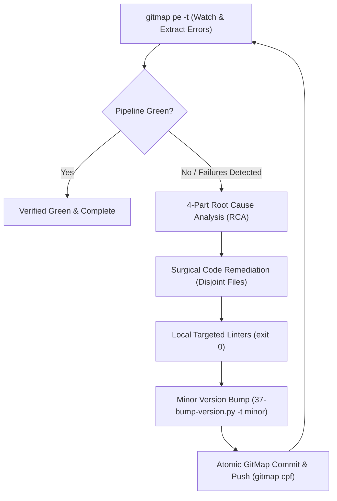

# Architecture Spec: Autonomous CI/CD Pipeline Healing via GitMap (`ci-cd-fix-gitmap`)

## 1. Overview & Purpose

The `ci-cd-fix-gitmap` workflow provides autonomous, self-healing pipeline diagnostics and continuous remediation across polyglot repositories. It leverages GitMap's live CI/CD pipeline telemetry (`gitmap pe -t`, `gitmap pipeline fix`, `gitmap pe`), extracts failing jobs and logs, performs grounded 4-part Root Cause Analysis (RCA), applies surgical code fixes without disabling tests or linters, verifies locally, and executes an atomic minor version release ceremony (`37-bump-version.py -t minor`). The engine continues looping until all remote pipeline checks are verified green.

## 2. Core Operational Workflow

## 3. Key Invariants

1. **Continuous Telemetry Loop:** Run `gitmap pe -t` to stream and inspect active pipeline execution until completion. If failures occur, immediately transition to root cause diagnosis.
2. **Grounded 4-Part RCA:**
   - **Part 1:** Exact failing step, job, and exit code.
   - **Part 2:** Root cause mechanism in code.
   - **Part 3:** Surgical remedy without disabling CI or commenting out checks.
   - **Part 4:** Local verification command proving resolution.
3. **Mandatory Minor Bump:** Every remediation cycle commits a minor release via `python 03-ai-scripts/37-bump-version.py -t minor`, tagging and pushing.
4. **Letterly Integration:**
   - Desktop: [`01-prompts/22-letterly/06-cicd-fix-release.md`](../../../01-prompts/22-letterly/06-cicd-fix-release.md) calls `ci-cd-fix-gitmap`.
   - Mobile: [`01-prompts/22-letterly/07-mobile-cicd-fix.md`](../../../01-prompts/22-letterly/07-mobile-cicd-fix.md) provides a one-line prompt calling `ci-cd-fix-gitmap`.

## 4. Acceptance Criteria

- [ ] `01-prompts/16-ci-cd/11-ci-cd-fix-gitmap.md` exists with V6 header (`N = 300`, `A = 2`, `H = 2`, `C = 30`).
- [ ] Companion skills exist in both `.agents/skills/ci-cd-fix-gitmap/skill.md` and `.cursor/skills/ci-cd-fix-gitmap/skill.md`.
- [ ] Letterly desktop and mobile CI/CD fix prompts invoke `ci-cd-fix-gitmap`.
- [ ] Relative paths verified and prompt indices updated.
