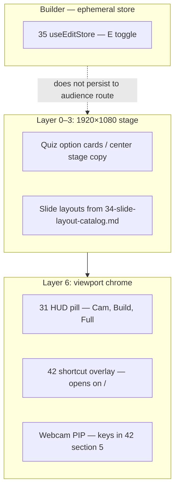

# 01 — Overview & Architecture

## User Request (Verbatim)

```text
If you look into the WP exam, we have the better preview in the slide system in the quizzes. I want you to look into how the implementation is done, color combination for the green part, and try to make it better. Also take the component example of how the components, checkboxes, animation, hover effect, text shadow. Similar to the text shadow as default that is mentioned in the spec, we need to have a box shadow. That will be default box shadow effect. It could be on images or other specs as a hover over, make it better, make it feel precise. Even if you add some code as an example so that AI does not hallucinate, please do that. Make sure that the code might run by Gemini, so your job is to write the spec so that AI can follow through. Make sure you also go through the global PPT to have the slide system for Riseup Asia LLC LLC coloring, sliding. All these idea of the responsiveness and also the builder mode and also the button to display the camera, display the shortcut. Shortcut also needs to be in the design system for slides. Also how to display a content in the center of the screen text, how to present stuff.
```

---

## 1. Problem statement

Quiz runners in the exam product ship a **presentation-grade option card** (horizontal nudge, primary-tinted hover wash, paired text-shadow and box-shadow tokens). The global JSON slide deck ships **presenter chrome** (HUD pill, camera, keyboard map, `1920×1080` stage, five transition names). Today those behaviors are not unified in one design-system contract, so agents invent shadows, keys, or green hex values.

This folder defines the **product architecture** (what to port, where it mounts). File `42-slide-quiz-preview-chrome-and-default-shadows.md` holds the **measurable CSS** agents must copy.

---

## 2. Measured sources (GitMap discovery)

Agents MUST locate live code with GitMap in the owning repo (never `rg` / `grep`):

| Concern | GitMap hint | Expected paths |
|:---|:---|:---|
| Option card CSS | `gitmap find presentation-option-card` | `src/styles/theme.css` |
| Green light theme tokens | `gitmap find green-choice` or `theme-green-choice` | `src/styles/theme.css`, `src/themes/theme-definitions.ts` |
| Focus quiz runner UI | `gitmap find FocusQuizRunner` | `src/components/runner/FocusQuizRunner.tsx` |
| Radix checkbox | `gitmap find CheckboxPrimitive` | `src/components/ui/checkbox.tsx` |
| Deck transitions | `gitmap find TransitionKind` | `src/constants/presentation.ts` |
| Shortcut matrix | `gitmap find SHORTCUTS` | `src/components/presentation/navigation/shortcuts.ts` |
| Shortcut dialog | `gitmap find KeyboardShortcutsDialog` | `src/components/presentation/navigation/KeyboardShortcutsDialog.tsx` |
| Presenter HUD | `gitmap cat` on `31-slide-controller-buttons.md` | coding-guidelines design system |

Public specs MUST NOT embed client trade names. Use theme ids from `40-theme-switch.md` (`bright-gold-tech`, etc.) and the quiz light id **`botanical-light`** (see file 42).

---

## 3. System boundaries



- **Quiz preview** may render inside the stage (embedded assessment slide) or full-viewport runner; tokens are identical.
- **Builder mode** (`E`) edits deck JSON only; it does not restyle quiz CSS globals.
- **Website visual builder** (`26-visual-builder.md`) is out of scope.

---

## 4. Deliverables in this spec pass

| Deliverable | Location |
|:---|:---|
| Default box-shadow + text-shadow pairs | `02-spec/07-design-system/42-slide-quiz-preview-chrome-and-default-shadows.md` |
| Improved botanical-light HSL table | Same file, section 3 |
| Shortcut groups for slides + camera | Same file, section 5; HUD button opens dialog |
| Center-stage typography grid | Same file, section 6 |
| Execution plan | `.ai-memory/plans/pending/13-slide-quiz-preview-and-presenter-chrome.md` |

Implementation in application repos is a **follow-on subtask**, not part of this authoring turn.

---

## 5. Non-goals

- Inventing a ninth slide theme without six supplied colors (`40-theme-switch.md` rule).
- Uploading CI artifacts or new GitHub Actions steps.
- Renaming production theme ids in shipped apps without a migration note.
