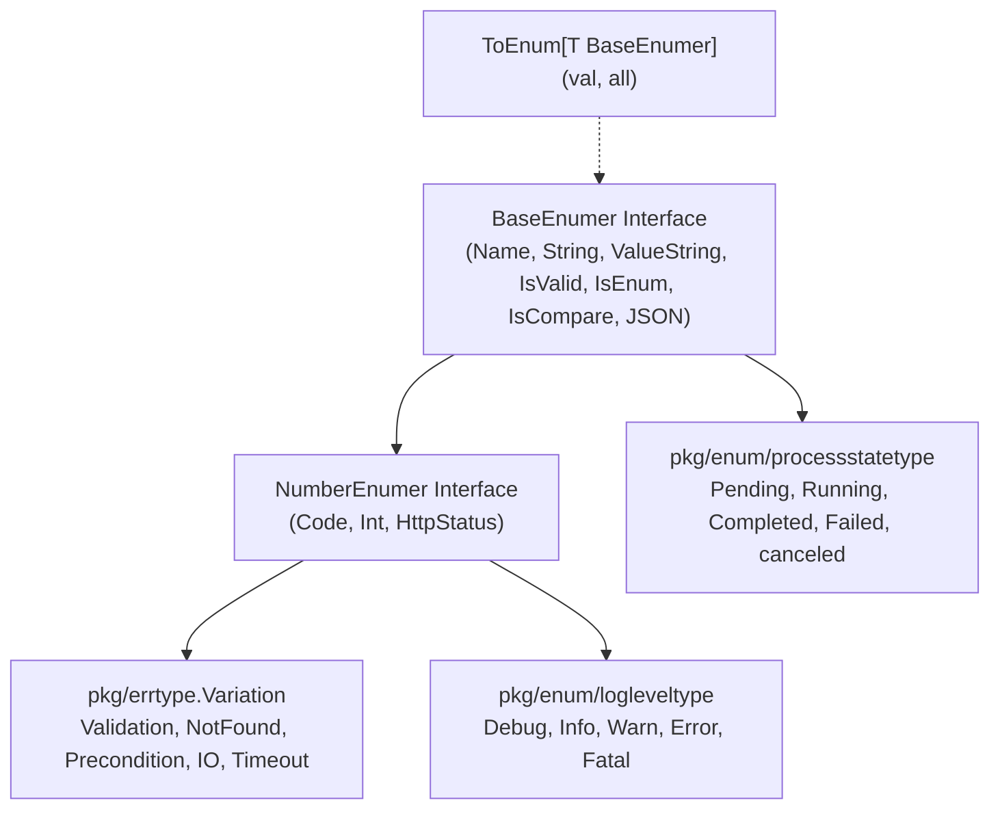

# Errtype Package Architecture & Specification

## Overview

The `errtype` package provides strongly-typed standardized error classification codes (`Variation`), HTTP status mappings, and universal enum interfaces (`BaseEnumer`, `NumberEnumer` with backward-compatible aliases `BaseEnum`, `NumberEnum`) across the repository. Domain-specific enumerations reside in dedicated packages under `pkg/enum/` (e.g. `pkg/enum/logleveltype/`, `pkg/enum/processstatetype/`).

---

## Architectural Principles

1. **`BaseEnumer` & `NumberEnumer` Universal Contracts:**
   All enum types adhere to standard Go interfaces conforming to the idiomatic `er` suffix convention:
   - `BaseEnumer` (alias `BaseEnum`): `Name() string`, `String() string`, `ValueString() string`, `IsValid() bool`, `IsEnum() bool`, `IsCompare() bool`, `MarshalJSON()`, `UnmarshalJSON()`.
   - `NumberEnumer` (alias `NumberEnum`): Extends `BaseEnumer` with numeric accessors: `Code() uint16`, `Int() int`, and `HttpStatus() int`.
2. **Dedicated Enum Hierarchy in `pkg/enum/`:**
   Domain-specific enums are housed in dedicated packages under `pkg/enum/` (`logleveltype`, `processstatetype`, `fileoptype`, `filepermtype`, etc.) using `03-ai-scripts/30-enum-generator.py`.
3. **Generic Lookup Helper (`ToEnum`):**
   A type-safe generic helper allows looking up any `BaseEnumer` by name, label, or numeric value string case-insensitively:
   ```go
   found, ok := errtype.ToEnum("running", processstatetype.All())
   ```
4. **1:1 File & Package Isolation:**
   Each enum type resides in its own dedicated package under `pkg/enum/`:
   - Dedicated package `pkg/enum/logleveltype/`: `variant.go`, `vars.go`, `variant_test.go` (`LogLevelType`)
   - Dedicated package `pkg/enum/processstatetype/`: `variant.go`, `vars.go`, `variant_test.go` (`ProcessStateType`)
   - Root `variation.go` & `methods.go`: `Variation` error classification codes
   - Root `base_enumer.go` & `base_enumer_test.go`: `BaseEnumer` forwarded interfaces and `ToEnum`

---

## Enum Architecture & Hierarchy Diagram



---

## Core Types & API

### 1. `Variation` (Error Type Code)

Standard classification codes mapped to HTTP status codes:
| Variation | Code | Name | HTTP Status |
| :--- | :--- | :--- | :--- |
| `None` | 0 | None | 200 OK |
| `Generic` | 1 | Generic | 500 Internal Server Error |
| `Validation` | 2 | Validation | 400 Bad Request |
| `NotFound` | 3 | NotFound | 404 Not Found |
| `Precondition` | 4 | Precondition | 400 Bad Request |
| `Execution` | 5 | Execution | 500 Internal Server Error |
| `Database` | 6 | Database | 500 Internal Server Error |
| `Network` | 7 | Network | 500 Internal Server Error |
| `Timeout` | 8 | Timeout | 504 Gateway Timeout |
| `IO` | 9 | IO | 500 Internal Server Error |
| `Unauthorized` | 10 | Unauthorized | 401 Unauthorized |
| `Forbidden` | 11 | Forbidden | 403 Forbidden |
| `Internal` | 12 | Internal | 500 Internal Server Error |
| `Unknown` | 13 | Unknown | 500 Internal Server Error |
| `Serialization` | 14 | Serialization | 400 Bad Request |

### 2. Domain Enums (`pkg/enum/`)

```go
import (
    "coding-guidelines/common/pkg/enum/logleveltype"
    "coding-guidelines/common/pkg/enum/processstatetype"
    "coding-guidelines/common/pkg/errtype"
)

// ProcessState
state := processstatetype.Running
if state.IsValid() {
    fmt.Printf("State: %s\n", state.Name())
}

allStates := processstatetype.All()
found, ok := errtype.ToEnum("completed", allStates)

// LogLevel
level := logleveltype.Info
fmt.Printf("Level Code: %d, Name: %s\n", level.Code(), level.Name())
```

---

## Automated Enum Generator CLI

Generate new enums or regenerate existing ones using the Python script `03-ai-scripts/30-enum-generator.py`:

```bash
# Generate a byte-backed enum in pkg/enum/
python 03-ai-scripts/30-enum-generator.py \
  --name taskstatus \
  --type byte \
  --items "Pending,Running,Completed,Failed" \
  --target 04-code/golang/pkg/enum/taskstatustype
```
