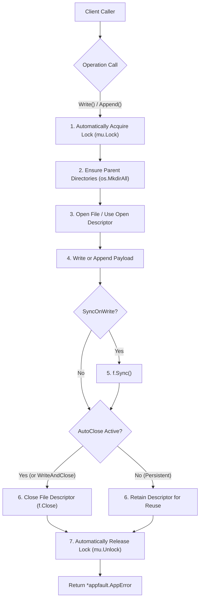

# Fileutil Package Architecture & Specification

## Overview

The `fileutil` package provides enterprise-grade filesystem utilities, behavior-shifting file writers, continuous append loggers, file-specific auto-locking handlers (`BoundFileWriter`), atomic swap operations, and granular file permission management.

---

## Architectural Principles

1. **Behavior-Shifting `FileWriter`:**
   Enables runtime switching of writing strategies via `.SetMode(mode)` without re-instantiating file handles:
   - `FileWriteModeDirect` (default): In-place streaming directly to the target file.
   - `FileWriteModeAtomic`: Writes completely to a temporary file in the same directory, flushes buffers, and atomically swaps it using `os.Rename`. Prevents corrupted partial writes during system crashes.
   - `FileWriteModeTruncate`: Truncates existing file content prior to writing.
2. **File-Specific Auto-Locking `BoundFileWriter`:**
   A reusable, file-bound object (`BoundFileWriter`, aliased as `SpecificFileWriter` and `FileHandler`) designed for operations on a specific file:
   - **Automatic Locking & Unlocking:** Every `.Write()`, `.WriteString()`, `.Append()`, and `.AppendString()` automatically acquires the mutex lock and releases it upon completion.
   - **Immediate Auto-Closing vs Persistent Reuse:**
     - In **AutoClose mode** (`.SetAutoClose(true)` or via `.WriteAndClose()` / `.AppendAndClose()`), the file descriptor is opened, written/appended to, synced, and closed immediately after writing is done. This prevents open file descriptor leaks when writes are infrequent.
     - In **Persistent mode** (default `autoClose: false`), the open file descriptor is retained across calls for maximum throughput and closed explicitly via `.Close()`.
   - **Transactional Batch Blocks (`WithLock`):** Callers can execute multiple writes and appends atomically under a single lock without interleaving:
     ```go
     err := writer.WithLock(ctx, func(w *fileutil.BoundFileWriter) *appfault.AppError {
         _ = w.AppendLocked(ctx, []byte("line 1\n"))
         _ = w.AppendLocked(ctx, []byte("line 2\n"))
         return nil
     })
     ```
   - **Manual Locking (`sync.Locker`):** Exposes `.Lock()`, `.Unlock()`, `.WriteLocked()`, and `.AppendLocked()`.
   - **Diagnostic Telemetry:** Atomic counters `.BytesWritten()`, `.BytesAppended()`, and `.WriteCount()`.
3. **Dedicated Continuous `FileAppender`:**
   Designed for persistent append-only workflows (journals, WALs, audit logs). Provides automatic parent directory creation, persistent file handles, thread safety, auto-syncing, and atomic byte counters (`.BytesAppended()`).
4. **Standard Library Compatibility via `StdWriter()` and `StdAppender()`:**
   All writer types implement `streamwriter.Writer[[]byte]` directly returning `*appfault.AppError`, and offer `.StdWriter() io.WriteCloser` adapters for seamless integration with `io.Copy`, `fmt.Fprintf`, and standard `log.SetOutput`.
5. **Strict Permission Types (`FilePermType`):**
   Strongly-typed bitmasks (`FilePermStandard`, `FilePermExecutable`, `FilePermReadOnly`, `FilePermOwnerOnly`, etc.) with octal parsing and inspection helpers (`.IsReadable()`, `.IsWritable()`, `.IsExecutable()`).
6. **Cross-Platform User Temp & Environment Expansion:**
   Multi-tier fallback temp directory resolution (`UserTempDir()`, `UserTempPath()`, `CreateTempFile()`, `CreateTempDir()`) and pure Go environment variable and tilde expansion (`Expand()`, `ExpandEnv()`, `ExpandTilde()`) supporting `$VAR`, `${VAR}`, Windows `%VAR%`, and `~`.
7. **Modular Path Normalization & Inspection:**
   Standardized path normalization (`Clean()`, `Normalize()`, `NormalizeToSlash()`, `ToSlash()`, `ToBackslash()`, `ToNative()`, `DeduplicateSeparators()`, `HasLongPathPrefix()`, `TrimLongPathPrefix()`, `ToLongPath()`) and inspection helpers (`Ext()`, `ExtNoDot()`, `HasExt()`, `Base()`, `Stem()`, `StemFull()`, `Slug()`, `Dir()`, `Split()`, `Parent()`, `ParentN()`, `IsAbs()`, `IsRel()`).
8. **Namespace Grouping & Fluent Path Builder:**
   The `Path` singleton organizes APIs into focused sub-namespaces (`Path.Temp.*`, `Path.Env.*`, `Path.Norm.*`, `Path.Info.*`, and `Path.Join(...)`). The fluent builder `NewPath(raw)` provides a chainable `*PathWrapper` supporting transformations, inspections, and direct file I/O (`Exists()`, `Stat()`, `Read()`, `WriteString()`).
9. **Unified Operational Namespace (`fileutil.File`):**
   Groups all operational file I/O into cohesive sub-operation namespaces (`File.Open.*`, `File.Create.*`, `File.Write.*`, `File.Append.*`, `File.Read.*`, and `File.Path.*`), maintaining zero heap allocations and 100% backward compatibility with top-level package functions.
10. **Coredata Creator Pattern Conformance (`fileutil.New`):**
    Adopting the zero-allocation creator pattern from `coredata` (`corestr`), constructor methods are organized under `fileutil.New` (`New.Writer.*`, `New.Appender.*`, `New.BoundWriter.*`, `New.Path.*`, `New.StreamWriter.*`), providing structured builders and intuitive discoverability.
11. **1:1 Struct-to-Filename Alignment:**
    Every operation and bound struct is housed in a dedicated file matching its exact snake_case name:
    - `appendOps` in `append_ops.go`
    - `openOps` in `open_ops.go`
    - `createOps` in `create_ops.go`
    - `readOps` in `read_ops.go`
    - `writeOps` in `write_ops.go`
    - `FilePathOps` in `file_path_ops.go`
    - `fileNamespace` in `file_namespace.go`
12. **Path-Bound Operations (`FilePathOps`):**
    Encapsulates `workDir`, `relPath`, and `absPath` into an immutable target object (`File.Target(path)` or `File.At(workDir, relPath)`). Eliminates the need to repeatedly pass file paths or handles, enforces pre-flight parent directory creation (`EnsureParentDir()`), provides safe file existence checks (`EnsureFile()`), and executes bound operations (`ReadString()`, `WriteString()`, `AppendLines()`) directly against `absPath`.

---

## BoundFileWriter Auto-Lock & Auto-Close Flow



---

## BoundFileWriter Lifecycle Architecture (ASCII Layout)

```
+-------------------------------------------------------------------------+
|                       BoundFileWriter / FileHandler                     |
|  - path: "data/state.json" (specific bound file)                        |
|  - mode: Direct | Atomic | Truncate                                     |
|  - perm: FilePermStandard (0644)                                        |
|  - autoClose: true (close on write) | false (reusable persistent handle)|
|  - mu: sync.Mutex (automatic or manual locking)                         |
|  - counters: bytesWritten, bytesAppended, writeCount                    |
+-------------------------------------------------------------------------+
                                    |
     +------------------------------+------------------------------+
     |                              |                              |
[Write Operations]          [Append Operations]          [Transactional Batch]
- .Write(ctx, data)         - .Append(ctx, data)         - .WithLock(ctx, fn)
- .WriteString(ctx, text)   - .AppendString(ctx, text)   - .Lock() / .Unlock()
- .WriteAndClose(ctx, data) - .AppendAndClose(ctx, data) - .WriteLocked(ctx, data)
- (auto lock/unlock)        - (auto lock/unlock)         - .AppendLocked(ctx, data)
     |                              |                              |
     +------------------------------+------------------------------+
                                    |
                    +---------------+---------------+
                    |                               |
          [AutoClose: true]               [AutoClose: false]
          - f.Close() immediately         - Retain open handle
          - Zero dangling file handles    - High-throughput streaming
          - Perfect for periodic writes   - Call .Close() when finished
```

---

## Core Types & API

### 1. `BoundFileWriter` (File-Specific Auto-Locking Writer/Appender)
```go
// 1. Creation bound to a specific file
writer := fileutil.NewBoundFileWriter("var/data/state.log")

// 2. Automatic lock write and append
err := writer.WriteString(ctx, "State: Initialized\n")
err = writer.AppendString(ctx, "Event: User logged in\n")

// 3. Configure auto-close after write (closes handle immediately)
writer.SetAutoClose(true)
err = writer.AppendString(ctx, "Event: Periodic checkpoint\n")
// File descriptor is now closed; no lingering file handle

// 4. Transactional lock block (multiple writes under one lock)
err = writer.WithLock(ctx, func(w *fileutil.BoundFileWriter) *appfault.AppError {
    _ = w.AppendLocked(ctx, []byte("--- Batch Start ---\n"))
    _ = w.AppendLocked(ctx, []byte("Record: 101\n"))
    _ = w.AppendLocked(ctx, []byte("--- Batch End ---\n"))
    return nil
})

// 5. One-off write and close
err = writer.WriteAndClose(ctx, []byte("Final Snapshot"))

// 6. Query diagnostics
fmt.Printf("Writes: %d, Written: %d bytes, Appended: %d bytes\n",
    writer.WriteCount(), writer.BytesWritten(), writer.BytesAppended())
```

### 2. `FileWriter` (Behavior Shifting)
```go
writer := fileutil.NewFileWriterEngine("configs/app.json")

// Direct write
_ = writer.WriteString(ctx, "mode: initial\n")

// Shift to atomic mode (writes to temp file, fsyncs, renames)
writer.SetMode(fileutil.FileWriteModeAtomic)
_ = writer.WriteString(ctx, "mode: atomic-update\n")

// Shift to truncate with fsync
writer.SetMode(fileutil.FileWriteModeTruncate).SetSyncOnWrite(true)
_ = writer.WriteString(ctx, "mode: clean-state\n")
```

### 3. `FileAppender` (Dedicated Continuous WAL/Journal)
```go
appender := fileutil.NewFileAppender("var/log/audit.log", fileutil.FilePermStandard)
appender.SetAutoSync(true)

_ = appender.AppendString(ctx, "EVENT: Transaction 9912 processed\n")
bytesAppended := appender.BytesAppended()
_ = appender.Close()
```

### 4. Standard Library Adapters (`io.WriteCloser`)
```go
// Adapters for io.Copy, fmt.Fprintf, log.SetOutput
stdWriter := writer.StdWriter()
stdAppender := writer.StdAppender()
```

### 5. `Path` Namespace Singleton
Organizes modular filepath functions into intuitive sub-namespaces:
```go
// Temp utilities
tempDir := fileutil.Path.Temp.UserTempDir()
tempFile := fileutil.Path.Temp.CreateTempFile("", "prefix-*.log", fileutil.FilePermStandard)

// Environment expansion
expanded := fileutil.Path.Env.Expand("~/configs/%APP_ENV%.yaml")

// Path normalization
norm := fileutil.Path.Norm.NormalizeToSlash(`C:\Users\test\\data\..\state.json`)

// Path inspection
ext := fileutil.Path.Info.Ext("document.pdf")
stem := fileutil.Path.Info.Stem("archive.tar.gz")      // "archive.tar"
stemFull := fileutil.Path.Info.StemFull("archive.tar.gz") // "archive"
slug := fileutil.Path.Info.Slug("My Report (v2)!.md")     // "my-report-v2"
parent := fileutil.Path.Info.ParentN("a/b/c/d", 2)       // "a/b"

// Quick Join
joined := fileutil.Path.Join("var", "log", "app.log")
```

### 6. Fluent `NewPath` Builder (`PathWrapper`)
Enables chainable transformations, inspections, and direct file operations:
```go
// Chain transformations
path := fileutil.NewPath(`~/%PROJECT%/data\..\output.json`).
    Expand().
    Clean().
    ToSlash()

// Inspect properties
fmt.Println("Base:", path.Base())
fmt.Println("Stem:", path.Stem())
fmt.Println("IsAbs:", path.IsAbs())

// Direct file I/O operations
if !path.Exists().Data() {
    _ = path.WriteString("{\"status\":\"ok\"}\n", fileutil.FilePermStandard)
}
content := path.ReadString().Data()
```

---

## Operational Namespace (`fileutil.File`)

The `File` singleton consolidates all operational file I/O into organized, zero-allocation sub-operation namespaces:

```go
// Open operations
fileRes := fileutil.File.Open.ReadOnly("data/config.yaml")
appendRes := fileutil.File.Open.CreateAppend("data/events.log", fileutil.FilePermStandard)

// Create operations
newFile := fileutil.File.Create.File("data/new.txt", fileutil.FilePermStandard)
dirRes := fileutil.File.Create.EnsureDir("data/nested/dir", fileutil.FilePermStandard)

// Write operations (with concrete Result types)
fileutil.File.Write.String("data/note.txt", "Hello World", fileutil.FilePermStandard)
fileutil.File.Write.Lines("data/lines.txt", []string{"row1", "row2"}, fileutil.FilePermStandard)
fileutil.File.Write.Json("data/state.json", stateObj, fileutil.FilePermStandard)
fileutil.File.Write.Atomic("data/atomic.bin", payloadBytes, fileutil.FilePermStandard)

// Append operations
fileutil.File.Append.String("data/events.log", "user login\n", fileutil.FilePermStandard)
fileutil.File.Append.BytesLocked("data/counter.bin", deltaBytes, fileutil.FilePermStandard)

// Read operations
linesRes := fileutil.File.Read.Lines("data/lines.txt")
textRes := fileutil.File.Read.Text("data/note.txt")

// Path operations (integrated Path namespace)
ext := fileutil.File.Path.Info.Ext("data/note.txt")
cleanPath := fileutil.File.Path.Norm.Clean("data//note.txt")
```

---

## Creator Namespace (`fileutil.New`)

Matching the `coredata` creator pattern (`corestr`), `fileutil.New` groups all constructor engines into cohesive sub-creators:

```go
// Writers
writer := fileutil.New.Writer.Default("data/stream.log")
atomicWriter := fileutil.New.Writer.Atomic("data/critical.json", fileutil.FilePermStandard)

// Continuous Appenders
appender := fileutil.New.Appender.AutoSync("data/wal.log", fileutil.FilePermStandard)

// Bound File Handlers
handler := fileutil.New.BoundWriter.AutoClose("data/intermittent.log", fileutil.FilePermStandard)

// Fluent Path Wrappers
pw := fileutil.New.Path.Default("data/config.yaml")

// StreamWriters
streamWriter := fileutil.New.StreamWriter.Append("data/stream.log", fileutil.FilePermStandard)
```

---

## Bound File Path Operations (`fileutil.FilePathOps`)

For scenarios where multiple operations are executed against a specific file path, `FilePathOps` eliminates repetitive path passing while enforcing directory safety and immutability:

### Instantiation

```go
// 1. Target by path (auto-resolves workDir and relPath against working directory)
target := fileutil.File.Target("configs/app.json")

// 2. Target with explicit workDir and relPath breakdown
item := fileutil.File.At("var/data", "metrics.log")

// 3. Creator equivalents via fileutil.New
target2 := fileutil.New.Target("configs/app.json")
item2 := fileutil.New.At("var/data", "metrics.log")
```

### Immutable Path Transformations

Modifications do not mutate the receiver; they return a newly allocated clone:

```go
// Relocate to a temporary working directory (e.g. for unit tests or sandbox runs)
sandboxTarget := target.WithWorkDir(t.TempDir())

// Switch relative target
altTarget := target.WithRelPath("configs/app.dev.json")

// Append subpath segments
subLog := item.Join("2026", "audit.log")
```

### Pre-Flight Safety Checks

Eliminates filesystem missing folder errors before I/O begins:

```go
// Ensure parent directory exists (creates with 0755 if missing)
dirRes := target.EnsureParentDir()

// Ensure file exists (creates parent directories and empty file if missing; does not truncate)
fileRes := target.EnsureFile(fileutil.FilePermStandard)

// Create file only if it does not exist yet (returns FileResult)
openRes := target.CreateIfNotExist(fileutil.FilePermStandard)
```

### Zero-Path Bound File Operations

Call file operations directly without passing the path or file descriptor:

```go
// Direct read
content := target.ReadString()
lines := target.ReadLines()

// Direct write (auto-ensures parent directories)
_ = target.WriteString(`{"status":"ready"}`, fileutil.FilePermStandard)
_ = target.WriteAtomic(dataBytes, fileutil.FilePermStandard)

// Direct append
_ = target.AppendString("new event\n", fileutil.FilePermStandard)
_ = target.AppendLines([]string{"line 1", "line 2"}, fileutil.FilePermStandard)

// Existence and inspection
if target.Exists() {
    statRes := target.Stat()
    fmt.Printf("File size: %d bytes\n", statRes.Data().Size())
}

// Cleanup
_ = target.Delete()
```

---

## AI Agent Skill: fileutil Operational Playbook

> [!IMPORTANT]
> When operating within this repository, AI agents MUST follow this operational playbook to guarantee error-free, safe, and portable filesystem manipulation.

### Rule 1: Choose the Right Abstraction Layer
1. **One-off independent operations:** Use `fileutil.File.<Op>.<Method>` (e.g., `fileutil.File.Read.Bytes(path)`, `fileutil.File.Write.String(path, text, perm)`).
2. **Multi-step operations on a single file:** Use `fileutil.File.Target(path)` (`FilePathOps`) to bind the path once and chain reads, writes, and pre-flight checks without repeating the path.
3. **Continuous / transactional writes under concurrency:** Use `fileutil.New.BoundWriter.AutoClose(path, perm)` or `NewBoundFileWriter(path)` with `.WithLock(...)`.
4. **Append-only log streams:** Use `fileutil.New.Appender.AutoSync(path, perm)`.

### Rule 2: Always Pre-Flight Parent Directories
- **Banned:** Blindly calling open/write without creating parent directories (risking runtime `ENOENT` failures).
- **Mandated:** When initializing a file or before reading from a potentially fresh path, call:
  ```go
  target := fileutil.File.Target(path)
  if err := target.EnsureParentDir(); err.IsFailed() {
      return err.Fault()
  }
  ```

### Rule 3: Enforce Immutability on Path Transformations
- `FilePathOps` is strictly immutable. Calling `.WithWorkDir(...)`, `.WithRelPath(...)`, or `.Join(...)` returns a new pointer.
- **Never** expect in-place mutation:
  ```go
  // CORRECT:
  subTarget := target.Join("subdir", "file.txt")

  // WRONG:
  target.Join("subdir", "file.txt") // target is NOT modified!
  ```

### Rule 4: Handle Concrete Results, Never Raw Errors
- All operations return concrete envelopes (`BoolResult`, `FileResult`, `BytesResult`, `StringResult`, `LinesResult`, `FileInfoResult`).
- Always check `.IsSuccess()` or `.IsFailed()`, and return `.Fault()` (`*appfault.AppError`):
  ```go
  res := target.WriteString(content, fileutil.FilePermStandard)
  if res.IsFailed() {
      return res.Fault()
  }
  ```

### Rule 5: 1:1 Struct-to-Filename Codebase Navigation
When locating or adding Go structs in `pkg/fileutil`, adhere strictly to lowercase snake_case naming matching the primary struct:
- Struct `appendOps` -> `append_ops.go`
- Struct `openOps` -> `open_ops.go`
- Struct `createOps` -> `create_ops.go`
- Struct `readOps` -> `read_ops.go`
- Struct `writeOps` -> `write_ops.go`
- Struct `FilePathOps` -> `file_path_ops.go`
- Struct `fileNamespace` -> `file_namespace.go`
- Struct `BoundFileWriter` -> `bound_file_writer.go`

---

## Usage Example

```go
package main

import (
    "context"
    "fmt"
    "log"
    "path/filepath"

    "coding-guidelines/common/pkg/fileutil"
)

func main() {
    ctx := context.Background()
    logPath := filepath.Join(".", "tmp-data", "service.log")

    // 1. Initialize file-specific BoundFileWriter
    writer := fileutil.NewBoundFileWriter(logPath)

    // Write header with auto-lock
    if err := writer.WriteString(ctx, "=== SERVICE AUDIT LOG ===\n"); err != nil {
        log.Printf("write failed: %v\n", err)
        return
    }

    // Append event with auto-lock
    if err := writer.AppendString(ctx, "INFO: Worker pool initialized\n"); err != nil {
        log.Printf("append failed: %v\n", err)
        return
    }

    // Enable auto-close so file handle closes immediately after writing
    writer.SetAutoClose(true)
    if err := writer.AppendString(ctx, "INFO: Checkpoint flushed to disk\n"); err != nil {
        log.Printf("append failed: %v\n", err)
        return
    }

    // Perform atomic multi-step batch under a single lock
    err := writer.WithLock(ctx, func(w *fileutil.BoundFileWriter) *fileutil.BoundFileWriter {
        _ = w.AppendLocked(ctx, []byte("TX 101: START\n"))
        _ = w.AppendLocked(ctx, []byte("TX 101: COMMIT\n"))
        return nil
    })
    if err != nil {
        log.Printf("batch failed: %v\n", err)
        return
    }

    fmt.Printf("Total operations: %d, Appended bytes: %d\n",
        writer.WriteCount(), writer.BytesAppended())
}
```
