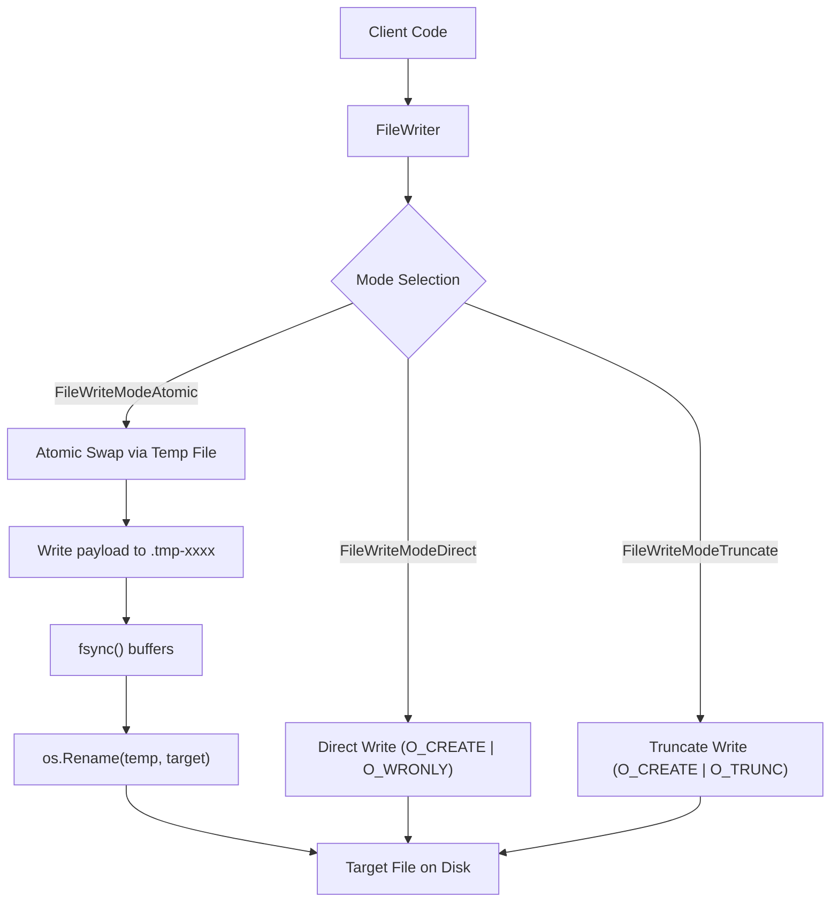

# Fileutil Package Architecture & Specification

## Overview

The `fileutil` package provides enterprise-grade filesystem utilities, behavior-shifting file writers, continuous append loggers, atomic swap operations, and granular file permission management.

---

## Architectural Principles

1. **Behavior-Shifting `FileWriter`:**
   Enables runtime switching of writing strategies via `.SetMode(mode)` without re-instantiating file handles:
   - `FileWriteModeDirect` (default): In-place streaming directly to the target file.
   - `FileWriteModeAtomic`: Writes completely to a temporary file in the same directory, flushes buffers, and atomically swaps it using `os.Rename`. Prevents corrupted partial writes during system crashes.
   - `FileWriteModeTruncate`: Truncates existing file content prior to writing.
2. **Dedicated Continuous `FileAppender`:**
   Designed for persistent append-only workflows (journals, WALs, audit logs). Provides automatic parent directory creation, persistent file handles, thread safety, auto-syncing, and atomic byte counters (`.BytesAppended()`).
3. **Standard Library Compatibility via `StdWriter()`:**
   Both `FileWriter` and `FileAppender` implement `streamwriter.Writer[[]byte]` directly with `*appfault.AppError` returns, and offer `.StdWriter() io.WriteCloser` adapters for seamless integration with `io.Copy`, `fmt.Fprintf`, and standard `log.SetOutput`.
4. **Strict Permission Types (`FilePermType`):**
   Strongly-typed bitmasks (`FilePermStandard`, `FilePermExecutable`, `FilePermReadOnly`, `FilePermOwnerOnly`, etc.) with octal parsing and inspection helpers (`.IsReadable()`, `.IsWritable()`, `.IsExecutable()`).

---

## Behavior-Shifting Flow Diagram



---

## FileAppender Continuous Logging (ASCII Layout)

```
+-------------------------------------------------------------------------+
|                              FileAppender                               |
|  - path: "logs/audit.log"                                               |
|  - perm: FilePermStandard (0644)                                        |
|  - autoSync: true / false                                               |
|  - bytesAppended: atomic.Int64                                          |
+-------------------------------------------------------------------------+
                                    |
                    +---------------+---------------+
                    |                               |
    [1. Ensure Open]                                [2. Append]
    - os.MkdirAll(dir, 0755)                        - file.Write(payload)
    - os.OpenFile(..., O_APPEND)                    - bytesAppended.Add(n)
                    |                               |
                    +---------------+---------------+
                                    |
                            [3. Auto Sync]
                            - file.Sync() (if autoSync active)
                                    |
                                    v
                     +-----------------------------+
                     |   Disk Storage (Audit Log)  |
                     +-----------------------------+
```

---

## Core Types & API

### 1. `FileWriter`
```go
// Creation
writer := fileutil.NewFileWriterEngine("configs/app.json")

// Behavior shifting
writer.SetMode(fileutil.FileWriteModeAtomic)
writer.SetPerm(fileutil.FilePermOwnerOnly)
writer.SetSyncOnWrite(true)

// Writing
err := writer.WriteString(ctx, `{"environment":"production"}`)

// Standard io.WriteCloser adapter
stdCloser := writer.StdWriter()
```

### 2. `FileAppender`
```go
// Creation with auto-directory creation
appender := fileutil.NewFileAppender("var/log/audit.log", fileutil.FilePermStandard)
appender.SetAutoSync(true)

// Continuous appending
err := appender.AppendString(ctx, "EVENT: Transaction 9912 processed\n")

// Query appended volume
bytesWritten := appender.BytesAppended()

// Clean close
err = appender.Close()
```

### 3. Atomic Write Utility
```go
res := fileutil.WriteAtomic("data/state.json", payloadBytes, fileutil.FilePermStandard)
if res.IsFailed() {
    return res.Fault()
}
```

---

## Usage Example

```go
package main

import (
    "context"
    "fmt"
    "path/filepath"

    "coding-guidelines/common/pkg/fileutil"
)

func main() {
    ctx := context.Background()
    dir := filepath.Join(".", "tmp-data")

    // 1. Initialize behavior-shifting writer
    fw := fileutil.NewFileWriterEngine(filepath.Join(dir, "config.yaml"))

    // Direct write initial configuration
    if err := fw.WriteString(ctx, "mode: initial\n"); err != nil {
        panic(err)
    }

    // Shift to atomic mode for mission-critical updates
    fw.SetMode(fileutil.FileWriteModeAtomic)
    if err := fw.WriteString(ctx, "mode: updated-atomic\n"); err != nil {
        panic(err)
    }

    // 2. Continuous journal appender
    appender := fileutil.NewFileAppender(filepath.Join(dir, "audit.log"), fileutil.FilePermStandard)
    defer appender.Close()

    if err := appender.AppendString(ctx, "Audit record 1: service up\n"); err != nil {
        panic(err)
    }

    fmt.Printf("Total audit bytes written: %d\n", appender.BytesAppended())
}
```
