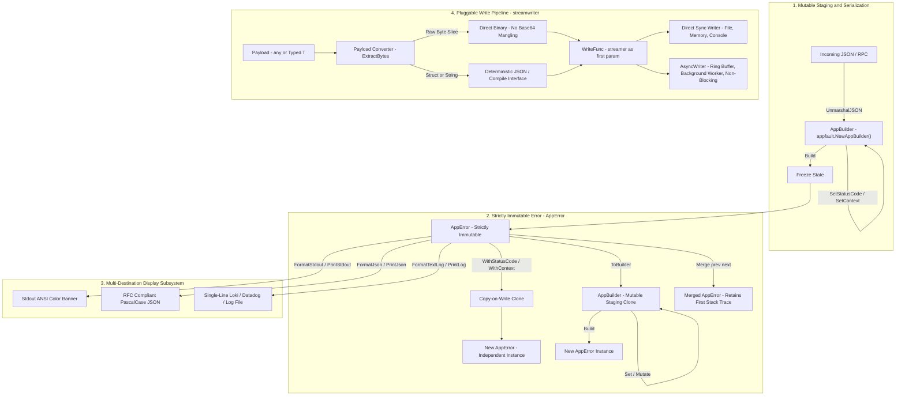

# Architecture Flow Reference

This document provides a visual and conceptual reference for the core Golang architecture implemented in `04-code/golang/pkg/`.

## Core System Architecture Flow

### Mermaid Flowchart



### ASCII Architecture Flow Diagram (100% Viewer Visible)

```text
+-----------------------------------------------------------------------------------------+
|                        1. MUTABLE STAGING & NETWORK SERIALIZATION                       |
|                                                                                         |
|   Incoming JSON / RPC ---> json.Unmarshal() ---> AppBuilder (appfault.NewAppBuilder())  |
|                                                          |                              |
|                                                          v .Build()                     |
+----------------------------------------------------------+------------------------------+
                                                           |
                                                           v
+-----------------------------------------------------------------------------------------+
|                        2. STRICTLY IMMUTABLE ERROR (*AppError)                          |
|                                                                                         |
|   +---------------------------------------------------------------------------------+   |
|   | struct AppError {                                                               |   |
|   |     errType  errtype.ErrorType  // 16-bit UTF-16 enum code                      |   |
|   |     message  string             // Human readable description                   |   |
|   |     caller   CallerInfo         // Value-based caller (file, line, func)        |   |
|   |     status   int                // HTTP status code (e.g. 404, 500)             |   |
|   |     context  *ContextMap        // Immutable contextual key-value pairs         |   |
|   |     stack    StackTrace         // Immediate capture via runtime.Callers        |   |
|   | }                                                                               |   |
|   +---------------------------------------------------------------------------------+   |
|           |                                       |                          |          |
|           v Derivation (Copy-on-Write)            v Mutation Staging         v Merge    |
|   .WithStatusCode(422)                    .ToBuilder()              Merge(prev, next)   |
|   .WithContext(k, v)                              |                          |          |
|           |                                       v                          v          |
|   New independent *AppError               AppBuilder.Build()        Retains first error |
|   (Original error untouched)              New *AppError instance    stack trace & count |
+-----------------------------------------------------------------------------------------+
                               |
           +-------------------+-------------------+
           |                                       |
           v                                       v
+-----------------------+   +-------------------------------------------------------------+
|  3. PRESENTATION      |   |  4. PLUGGABLE WRITE PIPELINE (pkg/streamwriter)             |
|                       |   |                                                             |
| .FormatStdout()       |   |   Payload (any or typed T)                                  |
|   -> ANSI colored banner  |          |                                                  |
| .FormatJson()         |   |          v                                                  |
|   -> PascalCase RFC JSON  |   PayloadConverter.ExtractBytes()                           |
| .FormatTextLog()      |   |   +-----------------------------------------------------+   |
|   -> Single line log  |   |   | []byte -> Direct binary (NO Base64 mangling)        |   |
+-----------------------+   |   | string -> Clean bytes (NO extra quotes)             |   |
                            |   | Struct -> Deterministic JSON / Compile() interface  |   |
                            |   +-----------------------------------------------------+   |
                            |          |                                                  |
                            |          v                                                  |
                            |   WriteFunc(streamer, ctx, writer, payload)                 |
                            |          |                                                  |
                            |          +--------------------------+                       |
                            |          |                          |                       |
                            |          v                          v                       |
                            |   Sync Writers:              Async Writers:                 |
                            |   - FileWriter (Atomic)      - AsyncWriter[T]               |
                            |   - MemoryWriter (Buffer)    - AnyAsyncWriter (Non-generic) |
                            |   - ConsoleWriter (Stderr)   - Ring/Channel Buffer Worker   |
                            +-------------------------------------------------------------+
```

## Subsystem Breakdown

### 1. Mutable Staging & Serialization
- **`AppErrorBuilder` (`AppBuilder`)**: Mutable staging container for assembling diagnostic metadata across multiple call steps or unmarshaling error responses over network RPC / JSON.
- Freezes into a strictly immutable `*AppError` upon `.Build()`.

### 2. Strictly Immutable Error (`*AppError`) & Error Merging
- **Copy-on-Write Immutability**: All derivations (`WithStatusCode`, `WithCaller`, `WithContext`, `WithOp`) clone the instance before applying changes.
- **Value-Based Caller Site**: `CallerInfo` is stored by value (`caller CallerInfo`) directly in `AppError` with zero heap allocation and natural immutability.
- **Error Merging & Multi-Loop Tracking**: `Merge(prev, next)` merges chained loop errors, preserving the first error's stack trace in `"FirstErrorStackTrace"` and recording loop attempts in `"LoopCount"` and `"StackTraceHistory"`.
- **Comprehensive Null Safety**: Nil and zero-value `*AppError` receivers never panic. Methods `IsNull()`, `IsEmpty()`, `HasZero()`, `IsZero()`, `HasNull()`, `Clone()`, and `Concat()` provide robust defensive checking.

### 3. Multi-Destination Presentation
- **Stdout Banner (`FormatStdout` / `PrintStdout`)**: Rich human-readable terminal output with severity icons, HTTP status codes, caller sites, and context.
- **Structured JSON (`FormatJson` / `PrintJson`)**: Machine-readable RFC JSON output with PascalCase fields and ISO diagnostics.
- **Log Aggregator Line (`FormatTextLog` / `PrintLog`)**: Single-line key-value output formatted for Loki, Datadog, Fluentbit, and ELK.
- **Hot-Swappable Custom Formatters**: Custom formatters can be plugged into `PrintWith(formatter, w)` for arbitrary output targets.

### 4. Pluggable Write Pipeline (`pkg/streamwriter`)
- **First Parameter Streamer**: `WriteFunc[T]` takes `streamer Streamer[T]` as its first parameter for direct pipeline streaming access.
- **Payload Intelligence**: `ExtractBytes` bypasses Base64 encoding for raw `[]byte` and strips surrounding quotes for strings.
- **Reference Semantics**: All active writer structs (`*PluggableWriter`, `*Logger`, `*Streamer`, `*BaseWriter`, `*AsyncWriter`) enforce pointer semantics.
- **Async Non-Blocking Writer**: `AsyncWriter[T]` and `AnyAsyncWriter` offer channel-buffered writes with background worker draining, configurable flush interval, drop-on-full protection, and graceful shutdown.
