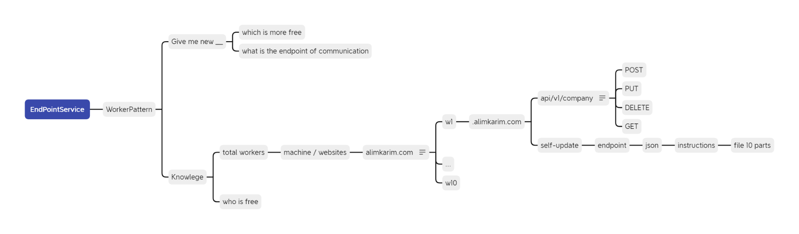

# 00 — Overview: Main / Worker Service Architecture

**Spec:** `19-main-worker-service`
**Version:** 1.0.0
**Updated:** 2026-05-04
**Default stack:** Laravel (PHP) — stack-agnostic by design.

---

## 0. Author Mindmaps (source of intent)

The architecture in this folder formalizes these author-drawn mindmaps.
The single best one-page summary is image 04. See [`images/readme.md`](./images/readme.md) for the full index.

---

Define a two-tier server topology where a **Main Server** acts as a coordinator (Kubernetes-master analogy) and one or more **Worker Servers** hold all business logic. The Main serves the UI and the React frontend's edge endpoints; Workers do the heavy lifting under their own split-DB.

This spec is the contract any implementer (AI or human) follows to build the topology. Details live in numbered files `01-`…`09-`. Diagrams live in `diagrams/`.

---

## 2. Scope

| In scope | Out of scope |
|----------|--------------|
| Main↔Worker topology, routing, auth handshake | Split-DB internals (see `spec/05-split-db-architecture/`) |
| Tenant→Worker mapping in main DB | Seedable-Config internals (see `spec/06-seedable-config-architecture/`) |
| Push-update mechanism (main → worker) | Self-update mechanism (pointer only — see `09-self-update-pointer.md`) |
| Role model + `User has access to {EnumPage}` pattern | Generic error handling (see `spec/03-error-manage/`) |
| Core API endpoint surface | Per-endpoint business logic |

---

## 3. Stack Flexibility (READ THIS)

The default reference implementation is **Laravel (PHP)**. Every rule in this spec is written stack-agnostically.

> **Future stacks explicitly supported:** .NET, Go (Golang), Python, Node.js, additional PHP frameworks (e.g., Symfony, raw PHP), WordPress as a host.

Implementer obligations regardless of stack:
1. Implement the same REST API surface (`06-core-api-endpoints.md`).
2. Honor the same auth contract (`05-auth-and-2fa.md`).
3. Use the same main-DB schema (`03-main-db-schema.md`) — column names PascalCase, PKs `{TableName}Id INTEGER AUTOINCREMENT`, no UUIDs.
4. Use the same error contract (`08-error-contract.md`) for main↔worker calls.

If a stack-specific deviation is unavoidable, document it in that stack's `99-consistency-report.md` and link back here.

---

## 4. Tenant Root Model

**Decision:** Company-as-root.

- Top-level entity: `Company`.
- A `Company` has many `User`s.
- Worker assignment is per-`Company`. All users of a company route to the same worker.
- Single-user products are modeled as `1 Company : 1 User` (degenerate case). No schema change.

Rationale: matches the verbatim's worked example (`POST /API/V1/Company`, "company-to-worker mapping"). See `plan.md` §Decisions.

---

## 5. Two-Tier Topology (one-paragraph version)

**Main Server** serves the React UI, holds a thin SQLite catalog (workers, tenant→worker map, versions), and routes business requests. It runs **no** business logic. **Worker Servers** are independent deployments of the same backend stack; each owns a split-DB (Root / App / Session per `spec/05-split-db-architecture/`) and runs all business logic. Both tiers ship with auth, 2FA, session, sign-up, sign-in, and JWT/cookie support out of the box; only the Main serves UI.

Full diagrams in `diagrams/` and details in `01-architecture.md`.

---

## 6. Document Map

| File | Purpose |
|------|---------|
| `plan.md` | Phased task list, decisions, open questions |
| `00-overview.md` | This file |
| `01-architecture.md` | Topology, request flow, boundaries |
| `02-glossary.md` | Canonical terms |
| `03-main-db-schema.md` | Main-server SQLite schema |
| `04-worker-routing.md` | Selection strategies, caching, failover |
| `05-auth-and-2fa.md` | Auth flows, 2FA, JWT/cookie, main↔worker handshake |
| `06-core-api-endpoints.md` | REST surface |
| `07-role-based-dashboards.md` | Roles + `User has access to {EnumPage}` pattern |
| `08-error-contract.md` | Main↔worker error semantics (inline) |
| `09-self-update-pointer.md` | Pointer-only doc (no implementation) |
| `97-acceptance-criteria.md` | Verbatim acceptance criteria mapping |
| `98-changelog.md` | Spec version history |
| `99-consistency-report.md` | Cross-link verification |
| `diagrams/` | Mermaid ERDs + sequence diagrams |

---

## 7. Compliance References

This spec inherits and does not redefine:

- `.lovable/coding-guidelines/coding-guidelines.md` — function length, zero-nesting, positive booleans, PascalCase, enum-for-Type/Status/Category/Kind
- `spec/04-database-conventions/` — DB schema rules (PascalCase, `{TableName}Id`, no UUIDs)
- `spec/05-split-db-architecture/` — worker-side split-DB
- `spec/06-seedable-config-architecture/` — config seeding for both tiers
- `spec/03-error-manage/` — generic error rules

---

*Overview v1.0.0 — 2026-05-04*
